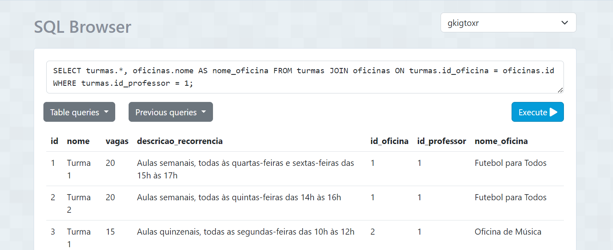
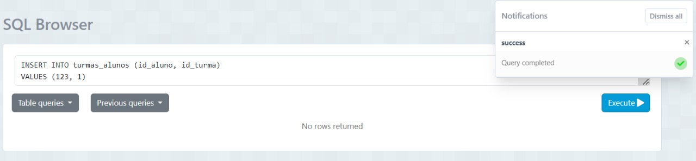
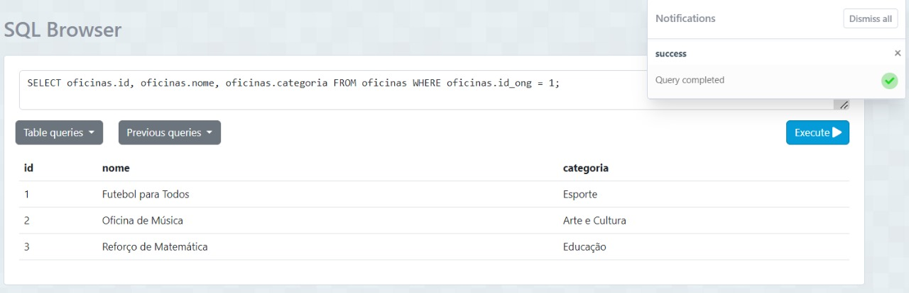
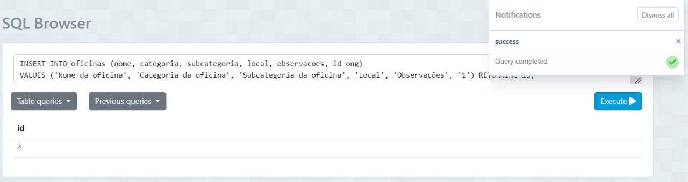

# Backend com Banco de Dados

Este relatório apresenta a documentação detalhada do desenvolvimento do backend com banco de dados para o nosso projeto. Optamos por concentrar a documentação nas consultas SQL essenciais, que representam os principais endpoints do backend. Esta abordagem foi escolhida para evitar a inclusão de todas as possíveis consultas e retornos, focando, em vez disso, nas que são fundamentais para compreender o funcionamento do sistema.

A documentação abrange descrições das consultas SQL, acompanhadas de screenshots das execuções, demonstrando o sucesso das operações realizadas. O objetivo é proporcionar uma visão clara e eficiente do funcionamento do backend e sua interação com o banco de dados.

## Funcionalidades Documentadas

### 1 - Login

#### Descrição

Esta funcionalidade permite que o login seja realizado na plataforma.

### Endpoint

- Rota: `/login`
- Método HTTP: POST
- Controller: `UserController.login`
- Repository: `UserRepository.findByCredentials`

#### Body da Requisição

```json
{
  "email": "joao@gmail.com",
  "senha": "joao123"
}
```

### Consultas SQL

```sql
SELECT * FROM users WHERE email = $1 AND senha = $2
```

### Teste da consulta SQL

Execução da consulta SQL para Login.


#### Teste do endpoint

Teste do endpoint do postman para verificar se o email e senha foram cadastrados.


### 2 - Visualizar as Turmas de um Professor

#### Descrição

Essa funcionalidade permite consultar todas as turmas associadas a um professor específico.

#### Endpoint

- Rota: `/turmas/:idProfessor`
- Método HTTP: GET
- Controller: `TurmaController.getByProfessorId`
- Repository: `TurmaRepository.findByProfessorId`

#### Consulta SQL

```sql
SELECT turmas.*, oficinas.nome AS nome_oficina
FROM turmas
JOIN oficinas ON turmas.id_oficina = oficinas.id
WHERE turmas.id_professor = $1;
```

#### Teste da Consulta SQL

Execução da consulta SQL para visualizar as turmas de um professor específico.



#### Teste do Endpoint

Teste do endpoint no Postman para verificar a visualização das turmas de um professor.


### 3 - Visualizar Aulas de uma Turma

#### Descrição

Essa funcionalidade possibilita a consulta de todas as aulas de uma turma específica.

#### Endpoint

- Rota: `/aulas/turma/:idTurma`
- Método HTTP: GET
- Controller: `AulaController.filterAulas`
- Repository: `AlunoRepository.filter`

#### Consulta SQL

```sql
SELECT * FROM aulas WHERE aulas.ocorrida = $1 AND id_turma = $2 ORDER BY data;
```

#### Teste da Consulta SQL

Execução da consulta SQL para visualizar as aulas de um turma.


#### Teste do Endpoint

Teste do endpoint no Postman que obtem as aulas de uma turma.


### 4 - Marcar lista de presença

### Descrição

Essa funcionalidade permite registrar a presença dos alunos em uma aula específica.

### Endpoint

- Rota: /presencas/registrar
- Método HTTP: POST
- Controller:PresencaController.registrarPresencas
- Repository: PresencaRepository.registrarPresencas

### Body da Requisição

```json
{
  "id": 122,
  "presente": true,
  "id_aluno": 1,
  "id_aula": 1
}
```

### Consulta SQL

```sql
INSERT INTO presencas (id, presente, id_aluno, id_aula)
VALUES ($1, $2, $3, 4$)
```

### Teste da Consulta SQL

Execução da consulta SQL para registrar a presença de um aluno em uma aula específica.


Após isso consultamos o banco para verificar se a presença foi registrada:


### Teste do Endpoint

Teste do endpoint no Postman para verificar a presença de um aluno em uma aula específica.


### 5 - Visualizar alunos inscritos

### Descrição

Essa funcionalidade permite visualizar os alunos inscritos em uma turma.

### Endpoint

- Rota: /turmas/:id/alunos
- Método HTTP: GET
- Controller: TurmaController.getByTurmaId
- Repository: TurmaRepository.findByTurmaId

### Consulta SQL

```sql
SELECT id_aluno
FROM turmas_alunos
WHERE id_turma = 1
```

### Teste da Consulta SQL

Execução da consulta SQL para visualizar os alunos de uma turma.


### Teste do Endpoint

Teste do endpoint no Postman para verificar a visualização de alunos inscritos em uma turma.


### 6 - Cadastrar e inscrever aluno novo

### Descrição

Essa funcionalidade permite cadastrar e inscrever um aluno novo em uma ONG.

### Endpoint

- Rota: `/alunos`
- Método HTTP: POST
- Controller: `AlunoController.create`
- Repository: `AlunoRepository.create`

### Body da Requisição

```json
{
  "id": 123,
  "nome": "Nome do aluno",
  "email": "email@example.com",
  "cpf": "123.456.789-00",
  "rg": "123456789",
  "estado_civil": "estado civil",
  "endereco": "endereco",
  "bairro": "bairro",
  "numero": "numero",
  "cidade": "cidade",
  "estado": "estado",
  "telefone": "123456789",
  "celular": "123456789",
  "raca": "raca",
  "genero": "genero",
  "data_nasc": "01/10/2000",
  "responsavel": "responsável"
}
```

### Consulta SQL

```sql
INSERT INTO alunos (id, nome, email, cpf, rg, estado_civil, endereco, bairro, numero, cidade, estado, telefone, celular, raca, genero, data_nasc, responsavel)
VALUES ($1, $2, $3, $4, $5, $6, $7, $8, $9, $10, $11, $12, $13, $14, $15, $16, $17)
```

### Teste da Consulta SQL

Execução da consulta SQL para cadastrar um aluno.


Após isso consultamos o banco para verificar se o aluno foi cadastrado:


### Teste do Endpoint

Teste do endpoint no Postman para verificar o cadastro de um aluno.


### 7- Inscrever aluno na turma

### Descrição

Essa funcionalidade permite a inscrição do aluno na turma.

### Endpoint

Rota: `/alunos/addToTurma`
Método: HTTP: POST
Controller: `AlunoController.addToTurma`
Repository: `AlunoRepository.addToTurma`

### Body da Requisição

```json
{
“id_aluno”: 123,
“id_turma”:1
}
```

### Consulta SQL

```sql
INSERT INTO “public”.”turmas_alunos” (id_aluno, id_turma)
VALUES ($1, $2)
```

### Teste da Consulta SQL

Execução da consulta SQL para inserir um aluno em uma turma específica.



Após isso consultamos o banco para verificar se a inscrição foi registrada:


### Teste do Endpoint

Teste do endpoint no Postman para verificar se aluno está inscrito na turma.


### 8 - Visualizar oficinas da ONG (Líder)

### Descrição

Essa funcionalidade permite a visualização das oficinas da ONG.

### Endpoint

Rota: /oficinas/:idOng
Método: HTTP: GET
Controller: `OficinaController.GetByOngId`
Repository: `OficinaRepository.FindByOngId`

### Consulta SQL

```sql
SELECT oficinas.id, oficinas.nome, oficinas.categoria
FROM oficinas
WHERE oficinas.id_ong = $1;
```

### Teste da Consulta SQL

Execução da consulta SQL para visualizar oficinas de uma ONG específica.



### Teste do Endpoint

Teste do endpoint no Postman para verificar a visualização das oficinas de uma ONG específica.


### 9- Cadastrar nova oficina (Líder)

### Descrição

Essa funcionalidade permite o cadastro de uma nova oficina.

### Endpoint

Rota: /oficina/create
Rota: `/oficina/create`
Método: HTTP: POST
Controller: `GETController: OficinaController.createOficina`
Repository: `OficinaRepository.create`

### Body da Requisição

```json
{
  "nome": "Nome da oficina",
  "categoria": "Categoria da oficina",
  "subcategoria": "Subcategoria da oficina",
  "local": "Local",
  "observacoes": "Observações",
  "id_ong": 1
}
```

### Consulta SQL

```sql
INSERT INTO oficinas (nome, categoria, subcategoria, local, observacoes, id_ong)
VALUES ($1, $2, $3, $4, $5, $6);
```

### Teste da Consulta SQL

Execução da consulta SQL para inserir uma oficina em uma ONG específica.



Após isso consultamos o banco para verificar se oficina foi criada:


### Teste do Endpoint

Teste do endpoint no Postman para verificar a criação de uma oficina em uma ONG específica.


### 10 - Visualizar tumas de uma oficina

### Descrição

Esta funcionalidade permite visualizar as turmas cadastradas em uma oficina.

### Endpoint

- Rota: `/oficina/:idOficina/turmas`
- Método HTTP: GET
- Controller: `TurmaController.getByOficinaId`
- Repository: `TurmaRepository.findByOficinaId`

### Consulta SQL

```sql
SELECT id, nome, descricao_recorrencia, id_oficina
FROM turmas
WHERE turmas.id_oficina = $1
```

#### Teste da Consulta SQL

Execução da consulta SQL para visualizar turmas cadastradas uma oficina.


#### Teste do Endpoint

Teste do endpoint no Postman para verificar as turmas cadastradas em uma oficina.


### 11 - Cadastrar turma em uma oficina

#### Descrição

Esta funcionalidade permite cadastrar turmas em uma oficina.

#### Endpoint

- Rota: `/turma/create`
- Método HTTP: POST
- Controller: `TurmaController.createTurma`
- Repository: `TurmaRepository.create`

#### Consulta SQL

```sql
INSERT INTO turmas (nome, vagas, descricao_recorrencia, id_oficina, id_professor)
VALUES ($1, $2, $3, $4, $5) RETURNING id, nome;
```

#### Teste da Consulta SQL

Execução da consulta SQL para cadastrar uma turma em uma oficina.


#### Teste do Endpoint

Teste do endpoint no Postman para verificar o cadastramento de uma turma em uma oficina.


### 12 - Agendar aulas em uma turma

#### Descrição

Esta funcionalidade permite agendar aulas em uma turma.

#### Endpoint

- Rota: `/inserir-aulas`
- Método HTTP: POST
- Controller: `AulaController.createAula`
- Repository: `AulaRepository.create`

#### Consulta SQL

```sql
INSERT INTO aulas (data, duracao, id_turma) VALUES
```

#### Teste da Consulta SQL

Execução da consulta SQL para agendar aula em uma turma.


#### Teste do Endpoint

Teste do endpoint no Postman para verificar o agendamento de aula numa turma.


### 13 - Visualização de Alunos da ONG

#### Descrição

Esta funcionalidade permite consultar todos os alunos associados a uma ONG específica.

#### Endpoint

- Rota: `/alunos/ong/:idOng`
- Método HTTP: GET
- Controller: `AlunoController.findByOng`
- Repository: `AlunoRepository.findByOng`

#### Consulta SQL

```sql
SELECT alunos.nome, alunos.email, alunos.id
FROM alunos
JOIN ongs_alunos ON alunos.id = ongs_alunos.id_aluno
WHERE ongs_alunos.id_ong = $1;
```

#### Teste da Consulta SQL

Execução da consulta SQL para visualizar os alunos da ONG.


#### Teste do Endpoint

Teste do endpoint no Postman para verificar a visualização de alunos da ONG.


### 14 - Visualizar Professores da ONG

#### Descrição

Esta funcionalidade permite visualizar todos os professores associados a uma ONG específica.

#### Endpoint

- Rota: `/professores/ong/:idOng`
- Método HTTP: GET
- Controller: `ProfessorController.getByOngId`
- Repository: `ProfessorRepository.filter`

#### Consulta SQL

```sql
SELECT id, nome, email
FROM users
WHERE id_cargo = 1 AND id_ong = $1;
```

#### Teste da Consulta SQL

Execução da consulta SQL para visualizar os professores da ONG.


#### Teste do Endpoint

Teste do endpoint no Postman para verificar a visualização de professores da ONG.


### 15 - Cadastrar Professor na ONG

#### Descrição

Esta funcionalidade permite cadastrar um novo professor em uma ONG.

#### Endpoint

- Rota: `/professor`
- Método HTTP: POST
- Controller: `ProfessorController.createProfessor`
- Repository: `ProfessorRepository.createProfessor`

#### Body da Requisição

```json
{
  "nome": "Nome do Professor",
  "email": "email@example.com",
  "senha": "senha123",
  "cpf": "123.456.789-00",
  "rg": "123456789",
  "id_cargo": 1, // ID do cargo de professor
  "id_ong": 1 // ID da ONG à qual o professor está associado (exemplo)
}
```

#### Consulta SQL

```sql
INSERT INTO users (nome, email, senha, cpf, rg, id_cargo, id_ong)
VALUES ($1, $2, $3, $4, $5, $6, $7);
```

#### Teste da Consulta SQL

Execução da consulta SQL para cadastrar um professor.


Após isso consultamos o banco para verificar se o professor foi cadastrado:


#### Teste do Endpoint

Teste do endpoint no Postman para verificar o cadastro de um professor.


