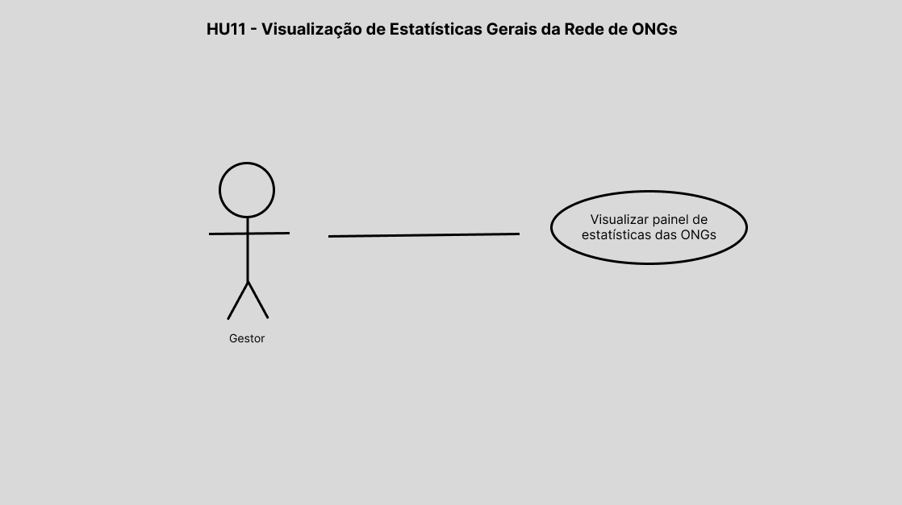
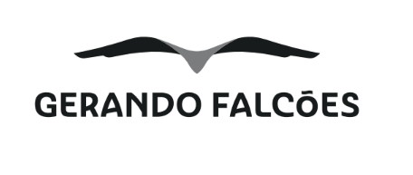
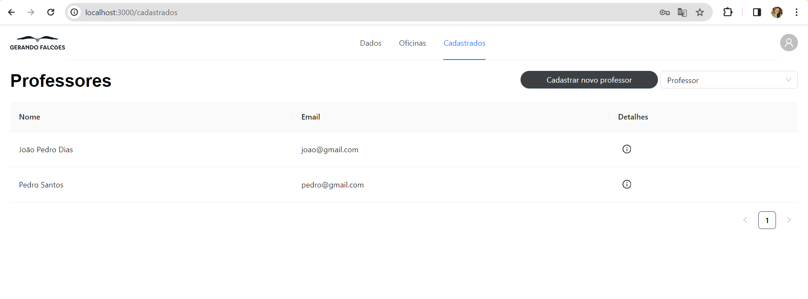

<table>
<tr>
<Table>
  <tr>
    <td><a href= "https://gerandofalcoes.com//"></td>
    <td>
      
    </td>
  </tr>
</table>

# Falcon 5 (F5)

## Falcon 5 (F5)

## :student: Integrantes:

- <a href="https://www.linkedin.com/in/breno-santana-4a1912228/">Breno Santana</a>
- <a href="https://www.linkedin.com/in/eduarda-cardoso-de-souza-8bb802268/">Eduarda Cardoso de Souza</a>
- <a href="https://www.linkedin.com/in/gabriellysilvavitor/">Gabrielly Silva Vitor</a>
- <a href="https://www.linkedin.com/in/jo%C3%A3o-pedro-sotto-maior-37b906207/">João Pedro Sotto</a>
- <a href="https://www.linkedin.com/in/raissa-vieira-de-melo/">Raissa Vieira de Melo</a>

## Sumário

- [1. Termos e Abreviações](#1-termos-abreviacoes)
- [2. Visão Geral do Projeto](#2-visão-geral-do-projeto)
  - [2.1 Entendimento da Demanda](#21-entendimento-demanda)
    - [2.1.1 Partes Interessadas](#211-partes-interessadas)
    - [2.1.2 Análise da Indústria](#212-analise-da-industria)
  - [2.2 Problema](#22-problema)
    - [2.2.1 Análise do Problema](#221-análise-do-problema)
    - [2.2.2 Análise do Cenário (Matriz SWOT)](#222-análise-do-cenário-e-Matriz-SWOT)
    - [2.2.3 5 Forças de Porter](#223-5-Forças-de-Porter)
- [3. Proposta da Solução](#3-proposta-de-solucao)
  - [3.1 Descritivo Geral da Solução](#31-descritivo-da-solucao)
  - [3.2 Proposta Tecnológica e Benefícios](#32-proposta-tecnologica-beneficios)
    - [3.2.1 Tipo de arquitetura de nuvem escolhida](#321-tipo-arquitetura-nuvem-escolhida)
    - [3.2.2 Arquitetura de nuvem escolhida](#322-arquitetura-nuvem-escolhida)
    - [3.2.3 Benefícios trazidos pela arquitetura de nuvem proposta](#323-beneficios-arquitetura)
  - [3.3 Proposta de Valor (Value Proposition Canvas)](#33-value-canvas)
  - [3.4 Matriz de Risco](#34-matriz-de-risco)
- [4. Análise de experiência do usuário](#4-experiencia-usuario)
  - [4.1 Perfis de Usuários](#41-perfil-usuario)
  - [4.2 Personas](#42-personas)
  - [4.3 Mapa de jornada do usuário](#43-jornada-usuario)
- [5. Requisitos](#5-requisitos)
  - [5.1 Requisitos Funcionais](#-51-requisitos-funcionais)
  - [5.2 Requisitos Não Funcionais](#52-requisitos-não-funcionais)
  - [5.3 User Stories](#53-user-stories)
  - [5.4 Casos de Uso](#54-casos-de-uso)
- [6. Projeto de Solução](#6-projeto-solucao)
  - [6.1 Diagrama de Classes](#61-diagrama-classes)
    - [6.1.1 Diagrama de Classes de Domínio](#611-diagrama-classes-dominio)
    - [6.1.2 Diagrama de Classes de Implementação](#612-diagrama-classes-implementacao)
  - [6.2 Diagrama de Implantação](#63-diagrama-implantacao)
  - [6.3 Tecnologias e Ferramentas](#64-tecnologias-ferramentas)
- [7. Interface](#7-interface)
  - [7.1 Design System](#71-design-system)
  - [7.2 Projeto de Interface (Wireframes)](#72-wireframe)
  - [7.3 Frontend](#73-frontend)
- [8. Projeto de Banco de Dados](#8-projeto-de-banco-de-dados)
  - [8.1 Modelo Conceitual](#81-modelo-conceitual)
  - [8.2 Modelo Lógico](#82-modelo-conceitual)
  - [8.3 Backend com Banco de Dados](#83-backend-com-banco-de-dados)
- [9. Testes de Software](#9-testes-de-software)
  - [9.1 Demonstração da integração](#91-demonstracao-integracao)
  - [9.2 Teste de Integração](#92-teste-de-integracao)
  - [9.3 Testes automatizados](#93-teste-automatizado)
  - [9.4 Testes de Usabilidade](#94-teste-de-usabilidade)
  - [9.5 Testes de Requisitos Não Funcionais](#95-teste-de-rnf)
- [10. Procedimento de Implantação da Solução](#10-procedimento-implantacao)
  - [10.1 Procedimento de Implantação do Sistema](#101-procedimento-implantacao-sistema)
  - [10.2 Procedimento de Implantação do Banco de Dados](#102-procedimento-implantacao-bd)
  - [10.3 Documentação Automática do Sistema (Swagger)](#103-documentacao-automatica)
- [Referências](#referências)
- [Apêndice](#apêndice)

# 1. Termos e Abreviações

<conteúdo>

# 2. Visão Geral do Projeto

Esta seção discorrerá sobre a visão geral do projeto. Será abordado o entendimento da demanda, as partes interessadas nesse projeto, uma análise da indústria e um aprofundamento sobre o problema trazido pelo parceiro.

## 2.1 Entendimento da Demanda

&emsp;&emsp;Nesta seção será feito um entendimento da demanda, descrevendo as partes interessadas e realizando uma análise da indústria de forma geral e detalhada, demonstrando a importância da Gerando Falcões como ONG no mercado.

### 2.1.1 Partes Interessadas

As principais partes interessadas envolvidas neste projeto são a Gerando Falcões (GF), um ecossistema de desenvolvimento social com o objetivo de acelerar o impacto dos líderes de favelas em todo o país na luta contra a pobreza; as ONGs apoiadas pela GF; os próprios líderes das ONGs; e os professores que ministram as oficinas.

### 2.1.2 Análise da Indústria

#### 2.1.2.1 Contexto da Indústria

&emsp;&emsp;A Gerando Falcões é uma ONG(Organização Não Governamental) que se enquadra no setor terciário da indústria, também conhecido como setor de serviços. Não possui nenhum fim lucrativo e dedica suas atividades a causas sociais, tendo como objetivo primordial promover a transformação social em comunidades periféricas, por meio de projetos nas áreas de educação, cultura, esporte, trabalho e renda.

&emsp;&emsp;O setor terciário desempenha um papel crucial nas economias modernas, proporcionando uma ampla gama de serviços essenciais para a sociedade e contribuindo significativamente para o crescimento econômico e o desenvolvimento social.

&emsp;&emsp;A Gerando Falcões atua no contexto de "Indústria social", que se refere a organizações e iniciativas que buscam promover o desenvolvimento humano e transformação social. A organização se denomina como um ecossistema de desenvolvimento social, que atua em rede para acelerar o poder de impacto de líderes em favelas do Brasil, em parceria com empresas, governos e outras organizações para ampliar seu impacto e fortalecer sua atuação.

#### 2.1.2.2 Modelo de Negócio

&emsp;&emsp;A Gerando Falcões possui um modelo de negócios diversificado, que abrange diferentes formas de captação de recursos e sustentabilidade financeira. A organização utiliza uma variedade de canais e parcerias para alcançar seus objetivos e manter suas operações funcionando, como descrito na tabela abaixo:

| Ação | Descrição |
| ---- | --------- |
| Doações | A Gerando Falcões recebe doações de pessoas físicas e jurídicas, que contribuem financeiramente para os projetos e iniciativas da organização. |
| Editais Públicos | A organização busca recursos por meio de editais públicos, concorrendo a financiamentos e subsídios governamentais para implementação de programas sociais.|
| Verba Governamental | Além dos editais públicos, a Gerando Falcões também busca recursos diretamente junto ao governo, por meio de parcerias e convênios para execução de projetos sociais. |
| Monetização de Serviços | A organização oferece serviços remunerados, como consultorias e capacitações, para empresas e instituições, como forma de gerar receita adicional. |
| Falcon University (Desenvolvimento de Líderes) | A Falcon University é um programa de desenvolvimento de lideranças que oferece cursos, palestras e workshops pagos, contribuindo para a autossustentabilidade da organização. |
| Bazar/Doação | A Gerando Falcões promove bazares e eventos de venda de produtos doados ou recebidos como parceria, revertendo os lucros para seus projetos sociais. |
| Parcerias com Terceiros/Venda de Produtos de Empresas | A organização estabelece parcerias com empresas, como a Havaianas, para a venda de produtos específicos cuja receita é revertida para a Gerando Falcões. |
| Cessão de Serviços/Produtos como AWS | A Gerando Falcões pode receber a cessão de serviços ou produtos de empresas, como a AWS (Amazon Web Services), para utilização em seus projetos, reduzindo custos operacionais. |
| Voluntários com Certificado | A organização incentiva a participação de voluntários, oferecendo certificados de participação e reconhecimento pelo trabalho voluntário, o que também contribui para o engajamento da comunidade e para a disseminação da causa. |

&emsp;&emsp;Essas estratégias permitem que a Gerando Falcões tenha uma base financeira sólida e diversificada, permitindo que suas atividades aconteçam e gerem lucro, garantindo o funcionamento e a continuidade de seus projetos e impacto positivo nas comunidades atendidas.

#### 2.1.2.3 Tendências

&emsp;&emsp;Tendência é estar atualizado sobre as tendências do mercado ajuda a garantir a oferta de produtos e serviços que atendam as necessidades e demandas dos clientes ou beneficiários, além de aumentar a credibilidade, relevância e impacto social causado.

&emsp;&emsp;A Gerando Falcões está alinhada com diversas tendências do mercado social, buscando inovar, estabelecer parcerias estratégicas e promover o engajamento da comunidade para ampliar seu impacto. Uma dessas tendências é a busca por alianças estratégicas, que são eficientes como forma de coleta de recursos. Através de parcerias com outras empresas que buscam reforçar seus valores ESG, instituições sociais como a Gerando Falcões podem receber recursos e esforço de voluntariado corporativo.

&emsp;&emsp;Além disso, o aumento no desenvolvimento de tecnologias, como a inteligência artificial, está cada vez mais presente no setor social. Isso permite maior eficácia na gestão de projetos, através do investimento em soluções para otimizar operações, melhorar a transparência e aumentar o alcance das iniciativas sociais.

&emsp;&emsp;Uma tendência importante é a crescente demanda por organizações que possam comprovar o impacto de suas ações sociais de forma mensurável. Isso inclui a avaliação de resultados e o uso de métricas específicas para demonstrar a eficiência dos programas. Portanto, a Gerando Falcões utiliza análises profundas para afirmar seu papel na sociedade e garantir que seus programas tenham um impacto positivo mensurável.

#### 2.1.2.4 3 Players de Mercado

&emsp;&emsp;No contexto de mercado, o termo "players" se refere a empresas ou organizações que atuam em um determinado mercado ou setor e que têm influência significativa sobre o mesmo. São empresas que têm uma participação relevante no mercado e que, muita das vezes, são consideradas referências ou líderes em suas áreas de atuação. Dessa forma, há organizações que são reconhecidas pelas suas iniciativas e programas sociais, bem como por sua capacidade de impactar positivamente as comunidades em que estão inseridas, assim como a Gerando Falcões.

&emsp;&emsp;Uma delas é a Fundação Bradesco, que tem o objetivo de proporcionar educação gratuita e de qualidade para crianças, jovens e adultos, prioritariamente em regiõescom vulnerabilidade socioeconômica. Pode-se citar também o Instituto Reciclar, que é uma organização sem fins lucrativos que atua na formação profissional de jovens em vulnerabilidade social, estimulando o aprendizado na prática, o desenvolvimento socioemocional e formação técnico-profissional de excelência.

&emsp;&emsp;Existe também o Instituto Coca-Cola Brasil, que é uma Organização da Sociedade Civil de Interesse Público(OSCIP) e tem como propósito ser agente de transformação social para reduzir as desigualdades e contribuir para o desenvolvimento socioeconômico do país. Vale destacar que, pela Gerando Falcões ser uma ONG sem fins lucrativos, os "players" aqui são relatados como organizações que também atuam no terceiro setor da indústria e possuem relevância mas que, não necessariamente, são competidores, já que nenhuma visa lucro e sim contribuir para o desenvolvimento da sociedade.

## 2.2 Problema

&emsp;&emsp;Nesta seção serão abordados uma análise do problema e uma análise do cenário da Gerando Falcões utilizando-se da matriz SWOT, apresentando então as forças, fraquezas, ameaças e oportunidades da Gerando Falcões no mercado/sociedade.

### 2.2.1 Análise do Problema

&emsp;&emsp;A problemática reside no fato de que mais de 80% da rede de líderes apoiada pela Gerando Falcões não utilizam uma solução para gerenciar seus atendimentos nos locais onde atuam. Isso resulta em uma escassez de informações sobre os reais impactos de suas ações, tanto para as ONGs quanto para a Gerando Falcões. Esta situação se deve, em parte, à complexidade das ferramentas de gestão disponíveis no mercado, as quais são demasiadamente complicadas para indivíduos sem experiência em tecnologia. Além disso, mesmo para aqueles familiarizados com tais tecnologias, a utilização demanda um tempo considerável, que muitas vezes não está disponível diante das múltiplas demandas e atividades.

### 2.2.2 Análise do Cenário (Matriz SWOT)

&emsp;&emsp;A análise SWOT é uma ferramenta estratégica amplamente utilizada por organizações para avaliar seus pontos fortes, fraquezas, oportunidades e ameaças. Essa técnica proporciona uma ótima visão do ambiente interno e externo de uma instituição, auxiliando na formulação de estratégias e tomadas de decisão. Ao identificar fatores críticos, a análise SWOT ajuda as empresas a maximizar seus recursos e a se adaptar ao ambiente competitivo em constante mudança.

  
Imagem 1 - Análise SWOT

  
  
Fonte: elaborada pelos autores.

### Forças (Strengths):

- Impacto significativo: Mais de 700 mil pessoas impactadas indica uma ampla influência social e uma base sólida para futuras iniciativas.
- Modelos de negócios sustentáveis: A colaboração com grandes marcas sugere uma abordagem inovadora e viável economicamente.
- Políticas públicas: A utilização conjunta com tecnologias avançadas para transformação social indica eficiência e modernidade.
- Reputação: Ser reconhecida como uma organização séria e que gera valor confere credibilidade e atrai suporte.

### Fraquezas (Weaknesses):

- Projetos de longo prazo: Esses projetos podem causar desconfiança devido à demora para mostrar resultados tangíveis.
- Visibilidade das ações: A falta de visibilidade pode limitar o reconhecimento e o apoio.

### Oportunidades (Opportunities):

- Políticas públicas favoráveis: O governo atualmente conhecido por apoiar os menos favorecidos possívelmente pode oferecer vantagens para a instituição.
- Mercado de tecnologia em ascensão: Um ambiente tecnológico em crescimento oferece oportunidades para inovação e colaborações.

### Ameaças (Threats):

- Concorrência por recursos: Por mais que o objetivo final de todas seja uma transformação social nas periferias, essa 'competição' com outras ONGs por financiamento e recursos é, de certa forma, um desafio a se enfrentar.
- Instabilidade política e econômica: Estes fatores podem afetar a continuidade e a previsibilidade das operações da organização.

A análise SWOT ofereceu uma compreensão aprofundada da intituição Gerando Falcões. Ao examinar suas forças, fraquezas, oportunidades e ameaças, ganhamos uma visão clara de sua posição no mercado em que está inserido. Esse entendimento robusto nos possibilita desenvolver o projeto a fim de potencializar os pontos fortes e amenizar os pontos fracos.

### 2.2.3 5 Forças de Porter

&emsp;&emsp;A análise das Cinco Forças de Porter é uma ferramenta utilizada para avaliar o ambiente competitivo de uma indústria. Ela ajuda a identificar os fatores que afetam a lucratividade de um setor e a entender a posição competitiva de uma empresa dentro desse contexto.

&emsp;&emsp;A Gerando Falcões, em sua atuação no setor social, enfrenta uma competição significativa por recursos e doações, dada a presença de várias outras organizações semelhantes buscando apoio financeiro e de outros tipos. Essa intensidade da competição é resultado do número considerável de concorrentes existentes no mercado. No entanto, a Gerando Falcões se destaca pela sua abordagem inovadora e impacto social tangível, o que pode reduzir a pressão da competição, mas ainda assim enfrenta desafios para se destacar em meio a tantas outras organizações similares.

&emsp;&emsp;Além da competição por recursos e doações, a organização também precisa lidar com o poder de barganha dos fornecedores, especialmente no que diz respeito aos recursos humanos e financeiros. A dependência de voluntários e colaboradores para a execução de seus programas pode limitar seu poder de barganha em relação a esses recursos. Da mesma forma, a dependência de doações e financiamentos governamentais pode limitar o poder de barganha da organização em relação aos seus financiadores.

  
Imagem 2 - 5 Forças de Porter

  
  
Fonte: elaborada pelos autores.

&emsp;&emsp;No que se refere ao poder de barganha dos compradores, representados pelos beneficiários e pela comunidade atendida, pode haver algum poder de barganha, especialmente se houver outras organizações oferecendo serviços semelhantes na região. No entanto, esse poder de barganha pode ser limitado devido à natureza dos serviços prestados e à escassez de alternativas viáveis.

&emsp;&emsp;A entrada de novas organizações no setor pode representar uma ameaça para a Gerando Falcões, pois aumentaria a competição por recursos e doações disponíveis. No entanto, as barreiras à entrada podem ser altas devido à necessidade de estabelecer uma reputação sólida e confiança junto aos doadores e à comunidade atendida.

&emsp;&emsp;Por fim, a Gerando Falcões também enfrenta a ameaça de produtos ou serviços substitutos, como outras organizações sociais que oferecem programas semelhantes ou alternativas de investimento social para doadores e financiadores. A diferenciação e o impacto social tangível dos programas da Gerando Falcões podem ajudar a mitigar essa ameaça, mas é importante estar atento às mudanças no ambiente competitivo e às necessidades da comunidade para se manter relevante e atrativa para seus stakeholders.

&emsp;&emsp;Nessa tabela abaixo é possível compreender melhor cada força e a explicação dos níveis descritos na imagem. Essa análise é de extrema importância para facilitar o entendimento de mercado e buscar oportunidades de melhorias, além de permitir que a Gerando Falcões possa buscar meios para se tornar cada vez mais perene.

  
Tabela - 5 Forças de Porter

  
| Força                                   | Nível | Descrição                                                                                                                                              |
| --------------------------------------- | ----- | ------------------------------------------------------------------------------------------------------------------------------------------------------ |
| Ameaça de produtos substitutos          | Baixa | Geralmente não há essa visão de produtos substitutos, por se tratarem de um serviço social.                                                            |
| Ameaça de entrada de novos concorrentes | Baixa | Geralmente não há essa visão de concorrência, por se tratarem de um serviço social.                                                                    |
| Poder de negociação dos clientes        | Baixa | Os clientes são contemplados com serviços já pensados com cada realidade, portanto, geralmente não há necessidade de negociação.                       |
| Poder de negociação dos fornecedores.   | Média | Fornecedores propõem parcerias pro-bono ou com descontos, pela GF ser uma ONG. O resto dos serviços costumam ser valor total, como serviço de energia. |
| Rivalidade entre os concorrentes        | Baixa | Os concorrentes são vistos como parceiros e não existe rivalidade, pois estão envolvidos na área social.  |

 
Fonte: elaborada pelos autores.

&emsp;&emsp;Com base na análise realizada, é evidente que a Gerando Falcões desempenha um papel fundamental na sociedade por meio de seu trabalho social, apoiado principalmente por meio de doações e parcerias. Isso lhe permite conquistar diversos apoios para garantir a continuidade e a perenidade de suas ações junto à população brasileira.

# 3. Proposta da Solução

&emsp;&emsp;Esta seção descreverá a solução desenvolvida, incluindo as tecnologias utilizadas, como a arquitetura em nuvem, e seus benefícios. Além disso, será empregada a Value Proposition Canvas para compreender como o produto entregará valor, e a matriz de risco para fornecer um panorama dos riscos que podem afetar o projeto e como evitá-los.

## 3.1 Descritivo Geral da Solução

&emsp;&emsp;A solução desenvolvida consiste em uma plataforma projetada para auxiliar principalmente os líderes das ONGs na gestão de seus atendimentos, proporcionando também à Gerando Falcões uma compreensão mais abrangente de seus impactos nos territórios em que atuam. Esta plataforma terá seu backend desenvolvido em Node.js e seu frontend em React, ambos utilizando JavaScript, e será integrada a um banco de dados relacional.

&emsp;&emsp;O produto final será hospedado na infraestrutura em nuvem da AWS (Amazon Web Services), visando oferecer ao parceiro uma solução acessível e escalável, além de segura para os dados coletados, tantos de pessoas quanto das ONGs parceiras.

## 3.2 Proposta Tecnológica e Benefícios

&emsp;&emsp;Esta seção explora a arquitetura de nuvem escolhida para o projeto. Aqui, apresentamos uma visão geral sobre o tipo de arquitetura de nuvem, suas principais características e os benefícios trazidos por esta proposta.

### 3.2.1 Tipo de arquitetura de nuvem escolhida

&emsp;&emsp;A arquitetura em nuvem apresenta três principais modelos de implantação: pública, privada e híbrida. Cada modelo é definido por características distintas que se alinham com requisitos específicos de negócio:

Nuvem Pública: Serviços de computação são oferecidos pela internet e compartilhados entre várias organizações. É valorizada pela sua escalabilidade, flexibilidade e eficiência de custo, ideal para necessidades que variam rapidamente.

Nuvem Privada: Infraestrutura dedicada a uma única organização, proporcionando maior controle e segurança. Esse modelo é frequentemente escolhido por aqueles que têm requisitos estritos de conformidade ou necessitam de muita personalização.

Nuvem Híbrida: Combina elementos das nuvens pública e privada, permitindo que as empresas tirem proveito da escalabilidade da nuvem pública, mantendo operações críticas ou sensíveis na nuvem privada. [2]

&emsp;&emsp;Para o projeto, a arquitetura de nuvem escolhida é a nuvem pública, que oferece uma série de vantagens, como escalabilidade, flexibilidade e eficiência de custo. A escolha por este modelo é motivada pela necessidade de uma solução acessível e escalável, que possa atender às demandas variáveis da Gerando Falcões e de suas ONGs parceiras.

### 3.2.2 Arquitetura de nuvem escolhida

&emsp;&emsp;A arquitetura de nuvem escolhida para o projeto é baseada nos serviços da AWS. A arquitetura de nuvem da AWS é construída sobre um conjunto de serviços fundamentais que oferecem escalabilidade, elasticidade e alta disponibilidade. A infraestrutura global da AWS é dividida em regiões e zonas de disponibilidade:

Regiões: São locais geográficos específicos em todo o mundo onde a AWS possui clusters de data centers. A escolha da região é fundamental para otimizar a latência, cumprir requisitos legais e de conformidade, e gerenciar custos.

Zonas de Disponibilidade: Dentro de cada região, as zonas de disponibilidade consistem em um ou mais data centers isolados com sua própria alimentação, refrigeração e redes físicas. Isso é projetado para oferecer redundância e alta disponibilidade, protegendo os serviços de falhas de um único local. [3]

Elasticidade e Escalabilidade: A AWS fornece serviços como Auto Scaling e Elastic Load Balancing que permitem que as aplicações se ajustem automaticamente à demanda, adicionando ou removendo recursos conforme necessário. Isso não só garante que a aplicação possa lidar com picos de tráfego sem interrupção, mas também otimiza os custos ao ajustar os recursos para a demanda atual. [4]

Os serviços escolhidos foram:

- Amazon EC2: Oferece capacidade de computação redimensionável na nuvem, permitindo a execução de aplicativos em servidores virtuais. Utilizaremos uma instância para o deploy do backend da aplicação e outra instância para o deploy do frontend da aplicação.
- Amazon RDS: Oferece bancos de dados relacionais na nuvem, facilitando a configuração, operação e escalabilidade de bancos de dados relacionais. Utilizaremos o Amazon RDS para armazenar os dados da aplicação.
- Amazon S3: Oferece armazenamento de objetos na nuvem, permitindo armazenar e recuperar qualquer quantidade de dados de qualquer lugar. Utilizaremos o Amazon S3 para armazenar os arquivos estáticos da aplicação.

### 3.2.3 Benefícios trazidos pela arquitetura de nuvem proposta

Adotar a arquitetura de nuvem da AWS oferece diversos benefícios para o projeto:

Alta Disponibilidade: Utilizando múltiplas zonas de disponibilidade, a arquitetura garante que as aplicações permaneçam operacionais mesmo em caso de falhas em um data center. Isso é importante para manter a continuidade dos negócios e a confiança dos usuários.

Escalabilidade: A capacidade de ajustar automaticamente os recursos conforme a demanda permite que o projeto cresça de forma sustentável. Os serviços de Auto Scaling garantem que a aplicação tenha os recursos necessários durante picos de uso, sem desperdício de capacidade durante períodos de baixa demanda.

Elasticidade: A arquitetura permite um ajuste dinâmico e rápido, tanto para escalonar quanto para desescalonar recursos. Isso significa que a aplicação pode responder agilmente às mudanças de uso, otimizando os custos operacionais e garantindo desempenho.

Segurança: A AWS oferece um ambiente altamente seguro, com uma ampla gama de ferramentas e serviços dedicados à proteção de dados, identidades, aplicações e redes. A configuração de VPCs, grupos de segurança e políticas de acesso ajuda a garantir que apenas usuários autorizados possam acessar recursos específicos. [5]

## 3.3 Proposta de Valor (Value Proposition Canvas)

&emsp;&emsp;O Value Proposition Canvas é uma ferramenta essencial para entender e visualizar como um produto ou serviço cria valor para seus clientes. Ele auxilia na identificação dos elementos-chave do valor oferecido e na compreensão das necessidades, desejos e dores dos clientes.

&emsp;&emsp;No caso da GF, o VPC é fundamental para analisar como os serviços prestados pela ONG são percebidos e utilizados pelos beneficiários, permitindo ajustes e melhorias contínuas para atender às suas necessidades de forma eficaz.

  
Imagem 3 - Value Proposition Canvas

  
  
Fonte: elaborada pelos autores.

&emsp;&emsp;A análise do Value Proposition Canvas (VPC) da Gerando Falcões (GF) revela a sua capacidade de criar valor significativo para seus beneficiários e comunidades atendidas. Portanto, é de suma importância para compreender qual a real necessidade de todos os serviços oferecidos pela GF para a sociedade.

## 3.4 Matriz de Risco

&emsp;&emsp;A Matriz de Riscos e Oportunidades é essencial para compreender os diversos cenários que podem impactar um projeto. Por meio dessa análise, identificamos tanto os possíveis obstáculos quanto as oportunidades que podem surgir, permitindo uma gestão proativa para alcançar os objetivos com sucesso. Este recurso oferece uma visão abrangente e estratégica, orientando as decisões a fim de prevenir problemas e nos preparar para as possíveis oportunidades.

  
Imagem 4 - Matriz de Riscos e Oportunidades

  
  
Fonte: elaborada pelos autores.

#### 1) Falta de experiência dos membros do grupo em cloud computing e desenvolvimento web:

Este risco é crítico, pois a falta de conhecimento técnico pode comprometer a qualidade e a segurança do produto. Membros inexperientes podem demorar mais para realizar tarefas e aumentar a probabilidade de erros.

#### 2) Atrasos nas entregas das tarefas:

Atrasos podem ser sintomas de problemas na gestão do projeto ou na alocação de recursos. Eles podem desencadear um efeito dominó sobre outras áreas do projeto, levando a mais atrasos. É essencial uma boa prática de gestão de tempo e priorização de tarefas.

#### 3) Membros do grupo ficarem indisponíveis no período das 10 semanas de desenvolvimento:

A ausência de integrantes sobrecarrega os outros membros do grupo, o que leva a um maior tempo de execução por tarefa, prejudicando o andamento do projeto. Isso pode ser causado por doenças, problemas pessoais, compromissos urgentes, entre outros.

#### 4) Falta de comunicação entre os membros do grupo:

A comunicação ineficaz pode resultar em falhas na compreensão dos requisitos, na sincronização de atividades e na colaboração. Implementar canais de comunicação claros e regulares (a exemplo do slack) e assegurar a documentação adequada são passos fundamentais para prevenir esse risco.

#### 5) Conflitos entre membros do grupo:

Conflitos podem surgir de diferenças de personalidade ou divergências técnicas. Eles prejudicam o ambiente de trabalho e a eficiência do grupo. Saber lidar com conflitos é importante para prevenir e resolver esses desintendimentos.

#### 6) Problemas relacionados a versionamento de código:

Quando utilizamos uma ferramenta de controle de código, como o git, Estamos sujeitos a erros humanos. Podem ocorrer sobreposições de trabalho, perda de código e regressões. Apesar da chance um erro grave relacionado a versionamento acontecer, temos sempre que previnir possíveis conflitos de informações.

#### 7) Serviços de cloud da AWS ficarem indisponíveis:

A dependência de terceiros traz o risco de interrupções de serviço. Apesar da chance ser baixa, a situação ainda se apresenta como um risco.

#### 8) Gerando Falcões receber uma solução barata de ser aplicada:

Esta oportunidade refere-se à possibilidade de a equipe desenvolver uma solução de baixo custo, que não apenas maximiza os recursos disponíveis mas também garante uma implementação mais fácil e viável economicamente. Representa uma oportunidade para o grupo se consolidar nos conhecimentos adquiridos durante o módulo.

#### 9) Gerando Falcões conseguir maximizar seu impacto nas favelas:

Representa a oportunidade de a equipe fazer uma diferença significativa em comunidades carentes através de seu projeto. Isso poderia não apenas satisfazer um objetivo social valioso, mas também reforçar a reputação e a responsabilidade social da organização.

#### 10) O cliente implementar o projeto em seu negócio:

Há a chance de que o cliente não apenas aceite a solução proposta mas também a integre com sucesso em suas operações diárias, o que pode levar a impactos positivos no dia a dia da intituição e no aprendizado dos membros do grupo.

&emsp;&emsp;Ao finalizar esta seção, fica claro que essa ferramenta é importante em nosso planejamento de projeto. Ao identificar e avaliar as possíveis dificuldades e oportunidades, estamos melhor preparados para tomar decisões e agir. Essa análise nos permite mitigar os riscos, capitalizar as oportunidades e ajustar nossa abordagem conforme necessário, aumentando assim as chances de sucesso e agregando valor à Gerando Falcões.

# 4. Análise de experiência do usuário

&emsp;&emsp;Nesta seção, a análise de experiência do usuário é abordada através de ferramentas como perfis de usuários, personas e mapas de jornada do usuário. Esses elementos são fundamentais para direcionar o desenvolvimento do projeto, garantindo que a solução proposta esteja alinhada com as necessidades e expectativas dos usuários finais, promovendo assim uma experiência intuitiva e satisfatória.

## 4.1 Perfis de Usuários

&emsp;&emsp;Perfis de usuário, em termos de Experiência do Usuário (UX), são representações dos diferentes tipos de usuários que podem interagir com um sistema, produto ou serviço. Eles ajudam a identificar e entender as necessidades, objetivos e comportamentos dos usuários, servindo como uma ferramenta essencial no desenvolvimento de soluções que sejam ao mesmo tempo funcionais e satisfatórias para o usuário final. Ao definir perfis de usuário, os desenvolvedores podem criar experiências mais personalizadas e efetivas, garantindo que o produto final atenda às expectativas e requisitos de seus diferentes públicos-alvo.

### Gestor

&emsp;&emsp;O Gestor, atuando como representante da Gerando Falcões, é o perfil de usuário com a visão mais ampla e estratégica sobre a rede de ONGs. Este usuário é essencialmente um administrador de alto nível, cujas atividades são cruciais para a coordenação, monitoramento e desenvolvimento das ONGs dentro da rede. Suas principais responsabilidades incluem:

- Visão estratégica: Como representante da Gerando Falcões, o gestor tem a visão global da rede de ONGs, utilizando a plataforma para monitorar e analisar dados que ajudam na tomada de decisões estratégicas.
- Gestão de dados: Responsável por visualizar e gerir informações detalhadas de todas as entidades envolvidas (ONGs, líderes, professores, alunos), incluindo criação, edição e exclusão de registros de ONGs. Isso envolve uma compreensão profunda dos impactos sociais e a capacidade de identificar oportunidades de melhoria.
- Foco no desenvolvimento e suporte: O gestor busca constantemente formas de desenvolver e apoiar as ONGs na rede, utilizando dados para fomentar iniciativas que maximizem o impacto social.

### Líder

&emsp;&emsp;O Líder é o responsável direto por uma ONG específica dentro da rede. Este perfil envolve uma gestão mais focada e operacional, lidando com as atividades cotidianas e a administração de recursos humanos e materiais. Suas principais atividades incluem:

- Gestão operacional: Encarregado das operações diárias de uma ONG específica, o líder gerencia professores e alunos, e é responsável pela organização de oficinas.
- Diversidade de letramento digital: Com diferenças significativas em letramento digital, a interface para líderes precisa ser intuitiva, permitindo a fácil gestão de atividades, cadastros e visualizações de histórico.
- Foco em histórico e análise de dados: Acesso a dados históricos e atuais para uma gestão eficiente, permitindo o acompanhamento de progresso e identificação de áreas para melhoria.

### Professor

&emsp;&emsp;O Professor é, muitas vezes, um voluntário que desempenha um papel direto na educação e no desenvolvimento dos alunos dentro das ONGs. Este perfil é caracterizado por uma interação intensa com os alunos e foco nas atividades educacionais. As principais atividades incluem:

- Interatividade com alunos: Focado no cadastro e na gestão de alunos nas oficinas, marcando presença e garantindo a participação ativa.
- Limitações de acesso a dados: Acesso limitado às informações, centrado na administração de oficinas e na interação direta com os alunos, sem envolvimento direto na gestão estratégica da ONG.
- Voluntariado e engajamento: Muitas vezes atuando como voluntários, os professores são cruciais no engajamento e desenvolvimento dos alunos, necessitando de ferramentas que facilitem esse trabalho.

&emsp;&emsp;A definição precisa desses perfis de usuário é crucial para o desenvolvimento de uma solução que atenda efetivamente às diferentes necessidades. Permitindo uma compreensão aprofundada das necessidades, características específicas e funcionalidades requeridas para gestores, líderes e professores, esta abordagem facilita a personalização da experiência do usuário e maximiza o potencial de impacto social do projeto. Este entendimento detalhado também serve como base para a próxima etapa de definição de personas, aprimorando ainda mais a estratégia de desenvolvimento de uma solução completa que gere valor para todos os usuários.

## 4.2 Personas

&emsp;&emsp;Personas são representações fictícias de um cliente ideal. Elas são baseadas em dados reais sobre comportamentos e características demográficas dos seus clientes. São apresentadas também suas motivações, objetivos, desafios e preocupações. Essa ferramenta é útil durante o desenvolvimento de um produto, pois nos ajuda a entender nosso público-alvo.

  
Imagem 5 - Persona Cecilia

  
  
Fonte: elaborada pelos autores.

  
Imagem 6 - Persona Fernanda

  
  
Fonte: elaborada pelos autores.

  
Imagem 7 - Persona Marcos

  
  
Fonte: elaborada pelos autores.

  
Imagem 8 - Persona Emanuel

  
  
Fonte: elaborada pelos autores.

## 4.3 Mapa de jornada do usuário

&emsp;&emsp;As personas criadas pela Gerando Falcões passam por uma jornada de usuário que reflete suas necessidades e experiências. Desde o primeiro contato com os programas da organização, as personas buscam soluções para desafios como desemprego, falta de acesso à educação e condições precárias de moradia. Ao longo dessa jornada, as personas encontram na GF um apoio significativo, recebendo orientação, capacitação e oportunidades que contribuem para sua transformação social e desenvolvimento pessoal.

  
Imagem 9 - Jornada de Usuário Gestor 

  
  
Fonte: elaborada pelos autores.

&emsp;&emsp;Essa Jornada de Usuário está relaciona a Persona da Fernanda Montenegro, Gestora da Gerando Falcões, que tem a necessidade de uma plataforma mais intuitiva e que apresenta informações gerais e individuais das ONGs atendidas pela GF. Nessa Jornada, é possível visualizar de forma clara como será um possível caminho que um gestor pode percorrer na plataforma.

  
Imagem 10 - Jornada de Usuário Gestor 

  
  
Fonte: elaborada pelos autores.

&emsp;&emsp;Essa Jornada de Usuário está relaciona a Persona do Emanuel Soares, Líder de uma ONG parceira da Gerando Falcões e também professor, que tem a necessidade de gerenciar as informações de sua ONG e das oficinas/aulas ministradas por ele. Nessa Jornada, é possível visualizar de forma clara como será um possível caminho que um líder pode percorrer na plataforma.

  
Imagem 11 - Jornada de Usuário Gestor 

  
  
Fonte: elaborada pelos autores.

&emsp;&emsp;Essa Jornada de Usuário está relaciona a Persona da Cecília Perez, professora de múscia de uma ONG parceira da Gerando Falcões, que tem a necessidade de gerenciar suas oficinas, aulas e o cadastro dos alunos, além de registrar presença/frequência dos mesmos em suas atividades. Nessa Jornada, é possível visualizar de forma clara como será um possível caminho que um professor pode percorrer na plataforma.

&emsp;&emsp;Portanto, é de extrema importância entender a necessidade de cada persona e como será a jornada ideial para que o usuário posso ter a melhor e mais eficaz experiência, promovendo assim melhor rendimento e organização. Cabe à equipe de desenvolvimento analisar as dores e buscar construir a plataforma que compreenda/solucione cada caso.

# 5. Requisitos

&emsp;&emsp;Nesta seção, são detalhados os requisitos do sistema, abrangendo desde os requisitos funcionais, que definem as funcionalidades essenciais do sistema, até os requisitos não funcionais, que estabelecem padrões de desempenho e segurança. User stories e casos de uso complementam a descrição, traduzindo esses requisitos em cenários práticos de uso, assegurando assim que o desenvolvimento esteja alinhado às necessidades reais dos usuários.

##  5.1 Requisitos Funcionais

&emsp;&emsp;Os Requisitos Funcionais desempenham um papel vital no desenvolvimento de softwares, especificando as funcionalidades que o sistema deve oferecer para atender às necessidades dos usuários. Esses requisitos detalham o comportamento do sistema, as interações com o usuário e as operações necessárias para realizar os objetivos do projeto. A elaboração precisa dos requisitos funcionais é essencial para guiar o desenvolvimento de uma solução eficaz e alinhada com as expectativas dos stakeholders. Abaixo estão listados os requisitos funcionais para o sistema:

### RF01 - Sistema de Login com Controle de Acesso

**Descrição:** O sistema deve permitir que usuários façam login utilizando seu email e senha. Após o login, o sistema deve identificar o tipo de acesso do usuário (gestor, líder, ou professor) e conceder permissões apropriadas baseadas em seu papel.
 **Teste:**
 **Pré-condição:** Usuário possuir email e senha cadastrado no banco de dados.
 **Procedimento:** Inserir email e senha na página de login.
Resultado esperado: O usuário recebe permissões respectivas ao seu tipo de acesso.
 **Pós-condição:** O usuário logado possui acesso às funcionalidades correspondentes ao seu tipo de acesso (gestor, líder ou professor).
 **Critério de aceitação:** Após o login bem sucedido o sistema identifica o tipo de acesso do usuário (gestor, líder ou professor).

### RF02 - Gestão de ONGs por Gestores

**Descrição:** Gestores podem visualizar, criar, editar e excluir ONGs, gerenciando todas as informações relevantes.
  **Teste:**
  **Pré-condição:** Gestor logado no sistema.
  **Procedimento:** Acessar a seção de ONGs, realizar uma das operações (criar, editar, visualizar, excluir).
  **Resultado esperado:** A operação é concluída conforme solicitado.
  **Pós-condição:** O banco de dados reflete a mudança realizada.
  **Critério de aceitação:** As operações devem ser executadas sem erros, e as mudanças devem ser persistentes no sistema.

### RF03 - Gestão de Oficinas por Líderes

**Descrição:** Líderes têm permissão para criar, visualizar, editar e excluir oficinas.
  **Teste:**
  **Pré-condição:** Líder logado e associado a uma ONG.
  **Procedimento:** Executar operações de gestão nas oficinas.
  **Resultado esperado:** Ações refletidas corretamente no sistema.
  **Pós-condição:** Atualizações salvas no banco de dados.
  **Critério de aceitação:** Mudanças precisam ser aplicadas de forma correta e visíveis para outros usuários autorizados.

### RF04 - Gestão de Professores por Líderes

**Descrição:** Líderes podem gerenciar professores, incluindo cadastrar, visualizar, editar e excluir.
  **Teste:**
  **Pré-condição:** Líder com acesso ao sistema.
  **Procedimento:** Realizar uma das ações de gestão de professores.
  **Resultado esperado:** Sistema atualiza conforme a ação executada.
  **Pós-condição:** Banco de dados atualizado.
  **Critério de aceitação:** Operações completadas com sucesso e informações atualizadas visíveis.

### RF05 - Gestão de Alunos por Líderes

**Descrição:** Líderes podem gerenciar alunos, incluindo cadastrar, visualizar, editar e excluir.
  **Teste:**
  **Pré-condição:** Líder está autenticado no sistema.
  **Procedimento:** Acessar a funcionalidade de gestão de alunos e realizar uma operação.
  **Resultado esperado:** Alterações refletidas no sistema.
  **Pós-condição:** Banco de dados contém as novas informações.
  **Critério de aceitação:** Ações de gestão realizadas sem erros e dados corretamente criados/atualizados.

### RF06 - Cadastro de Novos Alunos na oficina por Professores

**Descrição:** Professores têm a capacidade de cadastrar alunos diretamente nas oficinas em que dão aula. Caso o aluno ainda não esteja cadastrado na ONG, o sistema automaticamente o adiciona à ONG antes de associá-lo à oficina. Essa funcionalidade é exclusivamente para cadastro na oficina, sem que o professor tenha permissões para visualizar detalhes completos, editar ou excluir registros de alunos da ONG.
  **Teste:**
  **Pré-condição:** Professor logado no sistema.
  **Procedimento:** Acessar a lista de alunos inscritos, clicar no botão de cadastrar novo aluno, inserir as informações necessárias e submeter o cadastro.
  **Resultado esperado:** O aluno é adicionado à oficina e, se necessário, à ONG, com o banco de dados atualizado adequadamente.
  **Pós-condição:** O professor não tem acesso a funcionalidades de visualização detalhada, edição ou exclusão do aluno na ONG.
  **Critério de aceitação:** O sistema processa o cadastro com sucesso, adicionando o aluno à oficina (e à ONG, se aplicável), sem habilitar outras operações para o professor além do cadastro.

### RF07 - Controle de Presença por Professores

**Descrição:** Professores podem marcar presença dos alunos em suas respectivas aulas nas oficinas.
  **Teste:**
  **Pré-condição:** Professor logado e em uma aula específica de uma oficina em que dá aula.
  **Procedimento:** Selecionar alunos e marcar presença.
  **Resultado esperado:** Presenças registradas no sistema.
  **Pós-condição:** Dados de presença atualizados.
  **Critério de aceitação:** Presença marcada corretamente para os alunos selecionados.

### RF08 - Histórico de Participação na Oficina

**Descrição:** O sistema deve permitir que líderes e gestores visualizem detalhadamente os alunos inscritos e suas presenças registradas em cada aula de uma oficina específica.
  **Teste:**
  **Pré-condição:** Líder ou gestor autenticado com acesso às informações da oficina.
  **Procedimento:** Selecionar uma oficina específica e acessar o histórico de participação para visualizar os alunos presentes e suas respectivas aulas.
  **Resultado esperado:** Lista detalhada dos alunos inscritos em cada aula da oficina com indicação de presença.
  **Pós-condição:** Informações visualizadas.
  **Critério de aceitação:** O histórico de participação da oficina deve mostrar com precisão os alunos presentes e as aulas que participaram.

### RF09 - Exclusão de alunos inscritos em oficinas

**Descrição:** O sistema deve permitir que o professor da oficina exclua da lista de inscritos alunos que não fazem mais parte daquela oficina em questão.
  **Teste:**
  **Pré-condição:** Professor logado e com acesso à oficina em que dá aula.
  **Procedimento:** Selecionar uma oficina, acessar a lista de alunos e apertar em um botão ao lado do identificador do aluno que deseja excluir.
  **Resultado esperado:** Exibição de um modal para o usuário confirmar ou cancelar exclusão do aluno.
  **Pós-condição:** Banco de dados atualizado conforme opção escolhida. Se usuário confirmar o aluno será excluído da oficina específica, caso contrário nada será alterado.
  **Critério de aceitação:** Lista de alunos inscritos na oficina atualizada.

### RF10 - Exibição de Estatísticas dos Dados da ONG Selecionada

**Descrição:** O sistema deve exibir um painel de estatísticas de cada ONG para os líderes e gestores, que inclua:

- Número Total de Alunos Inscritos: Apresentando a quantidade atual de alunos matriculados em todas as oficinas oferecidas pela ONG.
- Número Total de Professores Ativos: Mostrando a contagem de professores atualmente envolvidos com as oficinas da ONG.
- Número Total de Oficinas Ativas: Indicando o número de oficinas que estão ativamente sendo oferecidas pela ONG no momento.
- Número Total de aulas oferecidas: O sistema deve exibir o número total de aulas oferecidas pela ONG até o momento.
- Frequência Média de Todas as Oficinas da ONG: O sistema deve calcular e mostrar a frequência média de participação nas oficinas da ONG.

  **Teste:**
  **Pré-condição:** O Líder ou Gestor logado com o acesso a área de estatísticas.
  **Procedimento:** Selecionar uma ONG e acessar os dados com as estatísticas.
  **Resultado esperado:** Exibição de dados com as estatísticas relacionada a ONG selecionada.
  **Pós-condição:** Banco de dados atualizado conforme opção de ONG escolhida.
  **Critério de aceitação:** Dados transmitidos em formato de estatísticas para o Líder da ONG e para o Gestor da GF.

### RF011 - Exibição de Estatísticas dos Dados das ONGs

**Descrição:** O sistema deve exibir um painel de estatísticas para o gestor com informações gerais sobre todas as ONGS, que inclua:

- Número Total de ONGs na Rede: O sistema deve apresentar o número total de ONGs operando na rede.
- Número Total de Alunos Inscritos na Rede: O sistema deve mostrar o número total de alunos inscritos em todas as ONGs da rede.
- Número Total de Professores Ativos na Rede: O sistema deve exibir o número total de professores ativos em todas as ONGs.
- Número Total de Oficinas Ativas na Rede:
  O sistema deve fornecer o número total de oficinas ativas em todas as ONGs.

  **Teste:**
  **Pré-condição:** O Gestor logado com o acesso a área de estatísticas de todas as ONGs.
  **Procedimento:** Selecionar uma ONG ou todas as ONGS, e acessar os dados com as estatísticas.
  **Resultado esperado:** Exibição de dados com as estatísticas relacionadas à(s) ONG(s) selecionada(s).
  **Pós-condição:** Banco de dados atualizado conforme opção de ONG escolhida.
  **Critério de aceitação:** Dados transmitidos em formato de estatísticas para o Gestor da GF.

### RF012 - Exibição de Estatísticas dos Dados das Oficinas

**Descrição:** O sistema deve exibir um painel de estatísticas sobre cada oficina para líderes e gestores, que inclua:

- Número de Participantes Ativos na Última Aula: O sistema deve informar o número de participantes ativos na última aula oferecida pela oficina.
- Número Total de Aulas Oferecidas por Oficina: O sistema deve apresentar o número total de aulas que foram oferecidas pela oficina específica até o momento.
- Número Total de Inscritos por Oficina: O sistema deve mostrar o número total de alunos inscritos atualmente na oficina específica.
- Frequência Atual Relacionada à Última Aula: O sistema deve calcular e exibir a frequência atual da oficina com base na última aula.
- Frequência Média Histórica da Oficina: O sistema deve calcular e fornecer a frequência média histórica, comparando o número médio de inscritos com o número de participantes em cada aula da oficina.

  **Teste:**
  **Pré-condição:** O Líder e Gestor logado com o acesso a área de estatísticas de todas as oficinas da ONG.
  **Procedimento:** Selecionar uma ONG e acessar os dados com as estatísticas das oficinas.
  **Resultado esperado:** Exibição de dados com as estatísticas das oficinas relacionadas à ONG selecionada.
  **Pós-condição:** Banco de dados atualizado conforme opção de ONG escolhida.
  **Critério de aceitação:** Dados transmitidos em formato de estatísticas para o Líder da ONG e Gestor da GF.

## 5.2 Requisitos Não Funcionais

&emsp;&emsp;Os Requisitos Não Funcionais são componentes cruciais no desenvolvimento de software, definindo critérios que não estão diretamente ligados às funções específicas do sistema, mas que são essenciais para garantir a qualidade e a eficiência do software. Estes requisitos abrangem aspectos como desempenho, segurança, confiabilidade, usabilidade e conformidade legal e regulatória, estabelecendo os padrões operacionais e técnicos que o software deve cumprir.

&emsp;&emsp;Ao contrário dos requisitos funcionais, que descrevem o que o sistema deve fazer, os requisitos não funcionais descrevem como o sistema deve ser, influenciando diretamente a experiência do usuário, a estabilidade do sistema e a facilidade de manutenção. [1] Abaixo estão listados os requisitos não funcionais para o sistema:

### RNF01 - Sistema acessível para todos os tipos de usuário

**ISO 25010:** Usabilidade.
 **Descrição:** O sistema deve ser simples, intuitivo e objetivo para usuários com qualquer nível de letramento digital, facilitando a navegação e compreensão.
 **Pré-condição:** O sistema é acessível e funcional.
 **Procedimento:** Usuário navegar entre as diferentes páginas e realizar ações de interação com os elementos da interface de forma eficaz, sem dificuldades significativas.
 **Resultado esperado:** O sistema oferece uma experiência de usuário fácil de entender e utilizar para todos os tipos de usuário.
 **Pós-condição:** Os usuários conseguem utilizar o sistema para realizar suas tarefas sem dificuldades e de maneira eficiente.
 **Critério de aceitação:** O tempo para realizar tarefas comuns no sistema ser razoável e não exigir esforços excessivos do usuário, além de todos serem capazes de utilizar a interface sem necessidade de assistência adicional.

### RNF02 - Sistema responsivo para dispositivos móveis

**ISO 25010:** Portabilidade.
 **Descrição:** O sistema deve possuir responsividade para dispositivos móveis, sendo capaz de se adaptar e fornecer uma experiência de usuário otimizada.
 **Pré-condição:** O sistema está disponível e funcional em dispositivos com telas menores.
 **Procedimento:** Acessar o sistema em diferentes dispositivos móveis.
 **Resultado esperado:** O sistema se ajusta dinamicamente às diferentes resoluções de tela, mantendo suas funcionalidades.
 **Pós-condição:** Os usuários são capazes de utilizar todas as funcionalidades do sistema de forma eficaz e sem dificuldades.
 **Critério de aceitação:** Todos os elementos da interface são exibidos corretamente e de maneira legível, sem comprometer a experiência do usuário.

### RNF03 - Desempenho de carregamento da tela de painel de estatísticas

**Descrição:** O sistema deve carregar a tela de painel de estatísticas em até 4 segundos.
  **ISO 25010:** Desempenho - Eficiência.
  **Teste:**
  **Pré-condição:** O sistema está disponível e funcional.
  **Procedimento:** O sistema carrega a tela de painel de estatísticas em diferentes condições de uso e carga de dados.
  **Resultado esperado:** A tela de painel de estatísticas é carregada dentro de 1 segundo em todas as circunstâncias.
  **Pós-condição:** Os usuários têm acesso rápido às estatísticas sem atrasos significativos.
  **Critério de aceitação:** O tempo médio de carregamento da tela de painel de estatísticas não excede 4 segundos em diferentes cenários de uso.

### RNF04 - Controle de acesso a informações

**Descrição:** O sistema deve garantir que o usuário não acesse informações indevidas para o seu tipo de acesso.
  **ISO 25010:** Segurança - Integridade.
  **Teste:**
  **Pré-condição:** O sistema está disponível e funcional.
  **Procedimento:** Os diferentes tipos de usuários tentam acessar informações não autorizadas.
  **Resultado esperado:** O sistema impede o acesso não autorizado a informações restritas para o tipo de usuário.
  **Pós-condição:** A integridade e a segurança das informações são mantidas, garantindo o acesso apenas às informações pertinentes para cada tipo de usuário.
  **Critério de aceitação:** Todos os acessos não autorizados são bloqueados, e os usuários só têm acesso às informações adequadas para o seu perfil.

### RNF05 - Validação de campos de entrada

**Descrição:** O sistema deve validar campos de entrada de informações.
  **ISO 25010:** Usabilidade - Adequação reconhecível.
  **Teste**:
  **Pré-condição:** O sistema está disponível e funcional.
  **Procedimento:** Os usuários tentam inserir informações em diferentes campos de entrada.
  **Resultado esperado:** O sistema valida os campos de entrada conforme critérios definidos.
  **Pós-condição:** As informações inseridas nos campos são consistentes e corretas.
  **Critério de aceitação:** Todas as entradas nos campos são verificadas e aceitas apenas se estiverem de acordo com os critérios de validação estabelecidos.

### RNF06 - Armazenamento em banco de dados relacional

**Descrição:** O sistema deve armazenar todas as informações relacionadas às ONGs, oficinas, aulas e usuários em um banco de dados relacional.
  **ISO 25010:** Manutenibilidade - Modificabilidade.
  **Teste:**
  **Pré-condição:** O sistema está disponível e funcional.
  **Procedimento:** Os dados relacionados às ONGs, oficinas, aulas e usuários são inseridos e armazenados no banco de dados.
  **Resultado esperado:** Todas as informações são armazenadas de forma correta e acessível no banco de dados relacional.
  **Pós-condição:** Os dados estão disponíveis para consulta e utilização em todo o sistema.
  **Critério de aceitação:** Todas as informações são corretamente armazenadas e recuperadas do banco de dados relacional, sem perdas ou inconsistências.

&emsp;&emsp;Portanto, os requisitos não funcionais apresentando as funcionalidades que serão expostas para os usuários, complementando a experiência dos usuários e indicando como deve ser o comportamento do sistema em relação aos seu funcionamento.

## 5.3 User Stories

&emsp;&emsp;User Stories são uma ferramenta simples e poderosa na engenharia de software, que permite descrever recursos e funcionalidades do sistema do ponto de vista do usuário final. São frases curtas que capturam o que o usuário quer fazer e por quê, facilitando para que os desenvolvedores entendam e atendam às necessidades reais dos clientes. Elas são essenciais na metodologia ágil, ajudando a equipe a manter o foco no valor que cada funcionalidade trará para o usuário, permitindo uma colaboração mais efetiva e uma priorização clara dos trabalhos.

&emsp;&emsp;Ao invés de se perder em documentações complexas, as User Stories oferecem um caminho direto para entender e implementar os requisitos essenciais de um projeto, alinhando as expectativas e facilitando a entrega de um produto que realmente gere valor para o usuário. Com base nos requisitos funcionais definidos na [seção 5.1](#requisitos-funcionais), foram elaboradas as seguintes User Stories:

### HU01 - Sistema de Login com Controle de Acesso

**Descrição:** 
Como usuário do sistema, quero poder fazer login utilizando meu email e senha para acessar funcionalidades específicas designadas ao meu papel dentro da organização. 
**Critérios de Aceitação:** 
1- O sistema deve oferecer uma interface de login onde os usuários podem inserir seu email e senha. 
2- Após inserção correta das credenciais, o sistema deve autenticar o usuário. 
3- O sistema deve identificar o tipo de acesso do usuário (gestor, líder, ou professor) baseado em suas credenciais. 
4- Conforme o tipo de acesso identificado, o sistema deve conceder permissões apropriadas, limitando ou habilitando acesso a funcionalidades específicas. 
5- Em caso de falha na autenticação, o sistema deve exibir uma mensagem de erro clara. 
**Prioridade:** 
Crítica 
**Estimativa de Esforço:** 
Média 
**Benefício do Usuário:** 
Proporcionar um sistema de login seguro e eficiente permite que os usuários acessem facilmente as funcionalidades necessárias para realizar suas tarefas, ao mesmo tempo em que mantém a integridade e a confidencialidade dos dados do sistema. 
**Persona:** 
Gestores, líderes e professores. 

### HU02 - Realizar gestão de ONGs

**Descrição:** 
Como um gestor, eu quero poder visualizar, criar, editar e excluir informações sobre as ONGs para gerenciar eficientemente as organizações.
**Critérios de Aceitação:** 
1- O sistema deve permitir que gestores procurem por uma ONG específica na tela de gestão de ONGs. 
2- O sistema deve permitir que gestores visualizem informações detalhadas de todas as ONGs cadastradas. 
3- Gestores devem ter a capacidade de cadastrar novas ONGs no sistema, incluindo as informações necessárias e relevantes para cadastro. 
4- Gestores devem poder editar informações de ONGs já cadastradas, como contato, endereço e categoria. 
5- Gestores devem ser capazes de excluir ONGs, com uma confirmação de ação para evitar exclusões acidentais. 
6- Apenas gestores têm permissão para acessar e realizar operações de visualização, criação, edição e exclusão de ONGs. 
**Prioridade:** 
Alta 
**Estimativa de Esforço:** 
Média 
**Benefício do Usuário:** 
Os gestores poderão gerenciar eficientemente a rede de ONGs, atualizando suas informações conforme necessário, garantindo assim que os dados estejam sempre precisos e atualizados. 
**Persona:** 
Gestores. 

### HU03 - Realizar gestão de Oficinas por Líderes

**Descrição:** 
Como líder, eu quero poder visualizar, criar, editar e excluir informações sobre as oficinas para organizar eficazmente as atividades realizadas pela minha ONG. 
**Critérios de Aceitação:** 
1- O sistema deve permitir que líderes procurem por uma oficina específica na tela de gestão de oficinas. 
2- Líderes devem ter a capacidade de visualizar informações detalhadas de todas as oficinas cadastradas. 
3- Líderes devem ser capazes de criar novas oficinas, fornecendo todas as informações necessárias para o cadastro. 
4- Líderes devem poder editar informações de oficinas já cadastradas, como **Descrição**, local e horário. 
5- Líderes devem ser capazes de excluir oficinas, com uma confirmação de ação para evitar exclusões acidentais. 
6- Apenas líderes têm permissão para acessar e realizar operações de visualização, criação, edição e exclusão de oficinas. 
**Prioridade:** 
 
**Estimativa de Esforço:** 
Média 
**Benefício do Usuário:** 
Os líderes poderão organizar eficazmente as atividades das oficinas, garantindo que as informações estejam sempre atualizadas e precisas. 
**Persona:** 
Líderes. 

### HU04 - Realizar gestão de Professores por Líderes

**Descrição:** 
Como um líder, desejo poder visualizar, criar, editar e excluir informações sobre os professores para garantir a disponibilidade adequada de pessoal para as oficinas. 
**Critérios de Aceitação:** 
1- O sistema deve permitir que líderes procurem por professores específicos na tela de cadastrados. 
2- O sistema deve permitir que líderes visualizem informações detalhadas de todos os professores cadastrados. 
3- Líderes devem ter a capacidade de cadastrar novos professores, fornecendo todas as informações necessárias para o cadastro. 
4- Líderes devem poder editar informações de professores já cadastrados, como nome, especialização e contato. 
5- Líderes devem ser capazes de excluir professores, com uma confirmação de ação para evitar exclusões acidentais. 
6- Apenas líderes têm permissão para acessar e realizar operações de visualização, criação, edição e exclusão de professores. 
**Prioridade:** 
Alta 
**Estimativa de Esforço:** 
Média 
**Benefício do Usuário:** 
Os líderes poderão garantir a disponibilidade adequada de professores para as oficinas, mantendo as informações atualizadas e precisas. 
**Persona:** 
Líderes. 

### HU05 - Realizar gestão de Alunos

**Descrição:** 
Como líder, quero poder visualizar, criar, editar e excluir informações sobre os alunos para gerenciar adequadamente a participação nas oficinas.
**Critérios de Aceitação:** 
1- O sistema deve permitir que líderes procurem por professores específicos na tela de cadastrados. 
2- O sistema deve permitir que líderes visualizem informações detalhadas de todos os alunos cadastrados. 
3- Líderes devem ter a capacidade de cadastrar novos alunos, fornecendo todas as informações necessárias para o cadastro. 
4- Líderes devem poder editar informações de alunos já cadastrados, como nome, contato e informações adicionais. 
5- Líderes devem ser capazes de excluir alunos, com uma confirmação de ação para evitar exclusões acidentais. 
6- Apenas líderes têm permissão para acessar e realizar operações de visualização, criação, edição e exclusão de alunos. 
**Prioridade:** 
Alta 
**Estimativa de Esforço:** 
Média 
**Benefício do Usuário:** 
Os líderes poderão gerenciar adequadamente a participação dos alunos nas oficinas, mantendo as informações atualizadas e precisas. 
**Persona:** 
Líderes. 

### HU06 - Cadastro de novos alunos na oficina

**Descrição:** 
Como professor, eu quero poder cadastrar novos alunos nas oficinas para que eles possam se beneficiar das atividades oferecidas pela ONG. 
**Critérios de Aceitação:** 
1- O sistema deve permitir que professores adicionem novos alunos diretamente na lista de participantes da oficina. 
2- Professores devem inserir informações essenciais dos alunos durante o cadastro, incluindo nome, idade e contato. 
3- O cadastro de um novo aluno por um professor deve automaticamente associá-lo à oficina e, por extensão, à ONG caso ainda não esteja cadastrado. 
4- Professores devem receber uma confirmação do sistema após o cadastro bem-sucedido de um novo aluno. 
5- Professores só podem cadastrar alunos na oficina em que dão aula, não sendo permitido adicionar alunos em outras oficinas ou apenas na ONG. 
**Prioridade:** 
Média 
**Estimativa de Esforço:** 
Baixa 
**Benefício do Usuário:** 
Permitir que professores incluam novos alunos assegura que todas as crianças e adolescentes interessados possam participar das oficinas, enriquecendo a experiência educativa e social fornecida pela ONG. 
**Persona:** 
Professores. 

### HU07 - Gestão de presença dos alunos

**Descrição:** 
Como professor, eu quero poder controlar a presença dos alunos nas aulas para monitorar a participação e engajamento nas atividades da oficina. 
**Critérios de Aceitação:** 
1- O sistema deve permitir que professores acessem a lista de participantes para cada aula. 
2- O sistema deve permitir que professores marquem a presença dos alunos dentro da lista de participantes da aula. 
4- O controle de presença deve ser atualizável, permitindo correções caso um aluno seja marcado incorretamente. 
6- Apenas professores da oficina específica têm permissão para gerenciar a presença dos alunos. 
**Prioridade:** 
Alta 
**Estimativa de Esforço:** 
Média 
**Benefício do Usuário:** 
Facilitar o controle de presença permite que professores tenham um registro preciso da participação dos alunos, o que é crucial para avaliar o engajamento e o sucesso das atividades oferecidas pela ONG. 
**Persona:** 
Professores. 

### HU08 - Visualização do histórico de participações por oficina

**Descrição:** 
Como um gestor ou líder, eu quero poder visualizar o histórico detalhado de participações para cada oficina para analisar a frequência e engajamento dos alunos nas atividades. 
**Critérios de Aceitação:** 
1- O sistema deve oferecer uma funcionalidade para visualizar o histórico de participações de cada oficina, incluindo cada aluno presente em cada aula. 
2- O sistema deve atualizar automaticamente o histórico de participações após cada aula registrada. 
3- Apenas gestores e líderes têm acesso ao histórico detalhado de participações por oficina. 
**Prioridade:** 
Média 
**Estimativa de Esforço:** 
Média 
**Benefício do Usuário:** 
A visualização do histórico de participações ajudará gestores e líderes a entender melhor o desempenho e o engajamento dos alunos nas oficinas, permitindo ajustes necessários para melhorar a oferta educacional. 
**Persona:** 
Gestores e líderes. 

### HU09 - Exclusão de alunos da lista de oficinas

**Descrição:** 
Como professor, eu quero poder excluir alunos da lista de inscritos na oficina que não fazem mais parte da atividade para manter a lista de participantes atualizada. 
**Critérios de Aceitação:** 
1- O sistema deve permitir que professores excluam alunos da lista de inscritos em sua oficina. 
2- Professores devem confirmar a exclusão do aluno para evitar remoções acidentais. 
3- A exclusão de um aluno deve atualizar automaticamente a lista de participantes inscritos na oficina e a lista de presença para as próximas aulas. 
4- Professores devem receber um feedback do sistema após a exclusão bem-sucedida de um aluno da lista de inscritos. 
**Prioridade:** 
Baixa 
**Estimativa de Esforço:** 
Baixa 
**Benefício do Usuário:** 
Permitir a exclusão de alunos que não participam mais das atividades assegura que os registros permaneçam precisos e facilita o gerenciamento da oficina para os professores. 
**Persona:** 
Professores. 

### HU10 - Visualização de Estatísticas da ONG

**Descrição:** 
Como um gestor ou líder, eu quero poder visualizar um painel de estatísticas de cada ONG para acompanhar indicadores chave como número total de alunos inscritos, professores ativos, oficinas ativas, e frequência média nas oficinas.
**Critérios de Aceitação:** 
1- O sistema deve exibir o número total de alunos inscritos em cada ONG. 
2- O sistema deve mostrar a contagem de professores atualmente envolvidos com as oficinas da ONG. 
3- Deve indicar o número de oficinas ativamente sendo oferecidas pela ONG. 
4- Deve exibir o número total de aulas oferecidas pela ONG até o momento. 
5- O sistema deve calcular e mostrar a frequência média de participação nas oficinas da ONG. 
6- Deve fornecer um gráfico de barras da frequência média das oficinas, segmentado por categorias. 
7- Apenas gestores e líderes têm permissão para acessar o painel de estatísticas da ONG. 
**Prioridade:** 
Média 
**Estimativa de Esforço:** 
Alta 
**Benefício do Usuário:** 
Facilitar o acesso a estatísticas chave permitirá aos gestores e líderes avaliar o desempenho da ONG, identificar áreas para melhoria, e tomar decisões informadas baseadas em dados concretos. 
**Persona:** 
Gestores e líderes. 

### HU11 - Visualização de Estatísticas Gerais da Rede de ONGs

**Descrição:** 
Como gestor, eu quero poder visualizar um painel de estatísticas gerais sobre todas as ONGs na rede para obter uma visão abrangente do impacto global das atividades. 
**Critérios de Aceitação:** 
1- O sistema deve apresentar o número total de ONGs operando na rede. 
2- Deve mostrar o número total de alunos inscritos em todas as ONGs da rede. 
3- Deve exibir o número total de professores ativos em todas as ONGs. 
4- Deve fornecer o número total de oficinas ativas em todas as ONGs. 
5- Apenas gestores têm permissão para acessar o painel de estatísticas gerais da rede. 
**Prioridade:** 
Média 
**Estimativa de Esforço:** 
Alta 
**Benefício do Usuário:** 
Proporcionar uma visão global das estatísticas da rede de ONGs permitirá aos gestores entender melhor o alcance e impacto das atividades, facilitando o planejamento estratégico e a alocação de recursos. 
**Persona:** 
Gestores. 

### HU12 - Visualização de Estatísticas por Oficina

**Descrição:** 
Como um líder ou gestor, eu quero visualizar um painel de estatísticas sobre cada oficina, incluindo número de participantes ativos, total de aulas oferecidas, inscritos por oficina e frequência média, para gerenciar efetivamente as atividades educacionais. 
**Critérios de Aceitação:** 
1- O sistema deve informar o número de participantes ativos na última aula de cada oficina. 
2- Deve apresentar o número total de aulas oferecidas pela oficina até o momento. 
3- Deve mostrar o número total de alunos inscritos na oficina específica. 
4- Deve calcular e exibir a frequência atual da oficina com base na última aula. 
5- Deve calcular e fornecer a frequência média histórica da oficina. 
6- Apenas líderes e gestores têm permissão para acessar o painel de estatísticas por oficina. 
**Prioridade:** 
Média 
**Estimativa de Esforço:** 
Média 
**Benefício do Usuário:** 
A visualização detalhada das estatísticas por oficina permitirá aos líderes e gestores monitorar o desempenho, fazer ajustes e melhorar as oficinas oferecidas com base nos dados. 
**Persona:** 
Líderes e gestores. 

&emsp;&emsp;As User Stories definidas servem como um direcionamento para o desenvolvimento do projeto, garantindo que cada funcionalidade a ser implementada seja essencial e valiosa para os usuários finais. Essas histórias de usuário foram fundamentais para entender o contexto de uso do sistema e as expectativas dos diferentes tipos de usuários – gestores, líderes e professores.

&emsp;&emsp;Com isso, é possível estabelecer uma ordem de trabalho que reflete as prioridades reais do projeto, permitindo priorização dos elementos que mais impactam a experiência do usuário. Ao final, essas User Stories não apenas guiam a criação de um sistema que atende às necessidades, mas também formam a base para testes e validações futuras, assegurando que o produto final seja prático, eficiente e acima de tudo, alinhado com a visão e missão do projeto.

## 5.4 Casos de Uso

  
Imagem 12 - HU01 - Sistema de Login com Controle de Acesso

  
  
Fonte: elaborada pelos autores.

<b>O diagrama acima se refere ao primeiro requisito funcional (RF01)</b>

  
Imagem 13 - HU02 - Realizar gestão de ONGs

  
  
Fonte: elaborada pelos autores.

<b>O diagrama acima se refere ao segundo requisito funcional (RF02)</b>

  
Imagem 14 - HU03 - Realizar gestão de Oficinas por Líderes

  
  
Fonte: elaborada pelos autores.

<b>O diagrama acima se refere ao terceiro requisito funcional (RF03)</b>

  
Imagem 15 - HU04 - Realizar gestão de Professores por Líderes

  
  
Fonte: elaborada pelos autores.

<b>O diagrama acima se refere ao quarto requisito funcional (RF04)</b>

  
Imagem 16 - HU05 - Realizar gestão de Alunos

  
  
Fonte: elaborada pelos autores.

<b>O diagrama acima se refere ao quinto requisito funcional (RF05)</b>

  
Imagem 17 - HU06 - Cadastro de novos alunos na oficina

  
  
Fonte: elaborada pelos autores.

<b>O diagrama acima se refere ao sexto requisito funcional (RF06)</b>

  
Imagem 19 - HU07 - Gestão de presença dos alunos

  
  
Fonte: elaborada pelos autores.

<b>O diagrama acima se refere ao sétimo requisito funcional (RF07)</b>

  
Imagem 20 - HU08 - Visualização do histórico de participações por oficina/p>
  
  
Fonte: elaborada pelos autores.

<b>O diagrama acima se refere ao oitavo requisito funcional (RF08)</b>

  
Imagem 21 - HU09 - Exclusão de alunos da lista de oficinas/p>
  
  
Fonte: elaborada pelos autores.

<b>O diagrama acima se refere ao nono primeiro requisito funcional (RF09)</b>

  
Imagem 22 - HU10 - Visualização de Estatísticas da ONG/p>
  
  
Fonte: elaborada pelos autores.

<b>O diagrama acima se refere ao décimo requisito funcional (RF10)</b>

  
Imagem 23 - HU11 - Visualização de Estatísticas Gerais da Rede de ONGs/p>
  
  
Fonte: elaborada pelos autores.

<b>O diagrama acima se refere ao décimo primeiro requisito funcional (RF11)</b>

  
Imagem 24 - HU12 - Visualização de Estatísticas por Oficina/p>
  
  
Fonte: elaborada pelos autores.

<b>O diagrama acima se refere ao décimo segundo requisito funcional (RF12)</b>

# 6. Projeto de Solução

<conteúdo>

## 6.1 Diagrama de Classes

&emsp;&emsp;Nesta seção, você encontrará uma poderosa ferramenta de visualização: os Diagramas de Classes. Essenciais para compreensão e colaboração eficientes no desenvolvimento de software, esses diagramas simplificam a complexidade da arquitetura do sistema, proporcionando uma visualização clara das classes, seus relacionamentos e comportamentos. Além de facilitar a comunicação entre membros da equipe e partes interessadas, os diagramas de classes promovem a modularidade, escalabilidade e identificação de áreas para otimização, fundamentais para o sucesso do projeto de software.

### 6.1.1 Diagrama de Classes de Domínio

&emsp;&emsp;Os diagramas de classes de domínio focam na modelagem das classes específicas de um domínio de negócio, oferecendo uma representação visual das entidades, seus atributos e relacionamentos. São fundamentais para a análise e design de sistemas, permitindo uma compreensão detalhada das estruturas e comportamentos dentro de um contexto específico. Ao utilizar os Diagramas de Classes de Domínio, os desenvolvedores podem criar soluções mais alinhadas às necessidades do negócio, resultando em sistemas mais eficientes e eficazes.

&emsp;&emsp;Na solução desenvolvida para a Gerando Falcões, o diagrama de classe de domínio destaca as entidades essenciais no código, como turmas, ONGs, professores, líderes e outros elementos, mostrando suas inter-relações. Esse diagrama é crucial para garantir a organização e o entendimento do sistema, permitindo visualizar de forma clara como essas entidades se conectam, se comportam e são utilizadas na implementação da solução.

  

  
Imagem 25 - Diagrama de Classe de Domínio 
  
  
Fonte: elaborada pelos autores.

### Professor:

Representa um professor ou instrutor.
Atributos: identificação (id), nome, email, CPF (Cadastro de Pessoa Física, um número de identificação fiscal no Brasil), RG (Registro Geral, um documento de identidade brasileiro).
Relacionamentos:
Um professor pode ensinar em várias turmas (relacionamento 0:N com a entidade Turma).

### Aluno:

Representa um estudante ou aprendiz.
Atributos: identificação, nome, email, CPF, RG, data de nascimento, estado civil, endereço, telefone, celular, raça, gênero e o responsável pelo aluno.
Relacionamentos:
Um aluno pode estar matriculado em várias turmas (relacionamento 0:N com a entidade Turma).
Um aluno pode ter várias presenças registradas (relacionamento 0:N com a entidade Presenca).

### Turma:

Representa uma classe ou grupo de estudo.
Atributos: identificação, nome e vagas disponíveis.
Relacionamentos:
Uma turma é composta por vários alunos (relacionamento 0:N com a entidade Aluno).
Uma turma é ministrada por um ou mais professores (relacionamento 0:N com a entidade Professor).
Uma turma ocorre em uma única oficina (relacionamento 1 com a entidade Oficina).

### Oficina:

Representa um local ou evento onde ocorrem as aulas ou atividades.
Atributos: identificação, nome, categoria e subcategoria da oficina, local e observações.
Relacionamentos:
Uma oficina está associada a uma única ONG (relacionamento 1 com a entidade Ong).
Uma oficina pode ocorrer em várias turmas (relacionamento 0:N com a entidade Turma).

### Ong:

Representa uma Organização Não Governamental.
Atributos: identificação, nome, endereço, complemento, bairro, estado, município, email, área de atuação e quantidade de favelas que atua.
Relacionamentos:
Uma ONG apoia uma oficina (relacionamento 1 com a entidade Oficina).
Uma ONG é liderada por um líder (relacionamento 1 com a entidade Lider).

### Presenca:

Representa o registro de presença de um aluno.
Atributos: identificação e um booleano indicando se o aluno estava presente.
Relacionamentos:
A presença está associada a um único aluno (relacionamento 1 com a entidade Aluno).

### Aula:

Representa uma sessão de ensino dentro de uma turma.
Atributos: identificação, nome e data.
Relacionamentos:
Uma aula está associada a uma única turma (relacionamento 1 com a entidade Turma).

### Lider:

Representa a pessoa responsável ou líder de uma ONG.
Atributos: identificação, nome, email, CPF e RG.
Relacionamentos:
Um líder está associado a uma única ONG (relacionamento 1 com a entidade Ong).

&emsp;&emsp;Por fim, é fundamental ter uma estrutura bem definida neste diagrama, com o objetivo de organizar e compreender melhor as conexões entre IDs, além de facilitar o trabalho dos desenvolvedores. Isso pode resultar em um site mais intuitivo e funcional para o uso cotidiano dos usuários parceiros da Gerando Falcões.

### 6.1.2 Diagrama de Classes de Implementação

&emsp;&emsp;Diagrama de implementação é uma representação visual da distribuição de componentes de software em um sistema e sua implantação em hardware. Para a arquitetura de um site, é essencial para planejar a infraestrutura, identificar falhas, otimizar recursos e facilitar a comunicação entre equipes, sendo fundamental para garantir o sucesso da implantação e manutenção de um site.

&emsp;&emsp;No projeto desenvolvido para a Gerando Falcões, o diagrama de classe de implementação ilustra a relação dos componentes e artefatos com os locais onde são utilizados no sistema implementado, incluindo APIs, repositórios, controllers e dados dos IDs. Essa representação facilita a organização e o entendimento do código, auxiliando na visualização da arquitetura e na identificação de possíveis melhorias ou otimizações.

&emsp;&emsp;Portanto, por meio deste diagrama de classes de implementação, a arquitetura da solução desenvolvida segue os padrões de implementação das funcionalidades do site, garantindo um melhor funcionamento. Ele mostra a interligação entre os IDs, os caminhos a serem percorridos dentro do código e outros elementos essenciais, proporcionando uma visão clara de como as partes do sistema se relacionam e como devem ser desenvolvidas para atender aos requisitos estabelecidos.

  

  
Imagem 26 - Diagrama de Classe de Implementação 
  
  
Fonte: elaborada pelos autores.

## 6.2 Diagrama de Componentes da Arquitetura

<conteúdo>

## 6.2 Diagrama de Implantação

&emsp;&emsp;O diagrama de implantação é uma representação visual utilizada em Engenharia de Software para especificar a configuração física dos artefatos de software em um sistema. Ele mostra como o software é distribuído em diferentes nós do hardware e descreve a configuração do hardware e a distribuição física dos componentes do sistema. Este diagrama é essencial para compreender como o sistema será implantado e como os componentes se comunicarão entre si.

  
Imagem ? - Diagrama de Implantação

  
  
Fonte: Elaborada pelos autores.

&emsp;&emsp;No diagrama apresentado, é possível observar uma arquitetura distribuída típica de um sistema baseado em nuvem. O front-end do sistema está hospedado em uma instância do Amazon EC2, que fornece capacidade de processamento escalável. Este front-end serve a interface com a qual os usuários interagem e se comunica via protocolo HTTP com o back-end, também hospedado em uma instância EC2, permitindo uma clara separação de responsabilidades e escalabilidade.

&emsp;&emsp;O back-end interage com uma instância do RDS (Amazon Relational Database Service), responsável pelo gerenciamento do banco de dados relacional do sistema. Essa interação se dá através de protocolos baseados em TCP/IP, permitindo uma comunicação segura e confiável para operações de leitura e escrita de dados.

&emsp;&emsp;Além disso, o sistema utiliza o Amazon S3 (Simple Storage Service) para armazenamento de dados que não são estruturados como banco de dados relacional. Isso é ideal para armazenar arquivos grandes, como imagens, vídeos e outros tipos de mídia. A comunicação com o S3 é feita sobre o protocolo TCP/IP, usualmente encapsulado por HTTP/HTTPS, que são padrões de comunicação segura e confiável na web. No contexto do projeto, caso seja implementada a funcionalidade de professores fazerem upload de imagens das oficinas por exemplo, o Amazon S3 é a escolha apropriada para esse armazenamento devido à sua alta durabilidade, disponibilidade e escalabilidade de armazenamento de objetos.

## 6.3 Tecnologias e Ferramentas

<conteúdo>

# 7. Interface

&emsp;&emsp;A interface se refere a parte da aplicação com o qual o usuário interage. Ela inclui todos os elementos visuais, como botões e áreas de conteúdo, que permitem ao usuário interagir com a aplicação para realizar tarefas específicas.

&emsp;&emsp;Uma boa interface é fundamental para garantir que os usuários possam usar a aplicação de forma eficaz e intuitiva. Isso envolve a disposição dos elementos da tela, o design visual, a consistência dos elementos de interação e a capacidade de resposta da aplicação aos comandos de quem está utilizando.

## 7.1 Design System

&emsp;&emsp;O Design System é uma abordagem fundamental para garantir consistência e eficiência no desenvolvimento de produtos digitais. Consiste em um conjunto de padrões, componentes e recursos compartilhados para promover uma experiência de usuário coesa em todas as interfaces. Nesta seção vamos abordar alguns conceitos e componentes, além de apresentar exemplos de aplicação do Design System da Gerando Falcões.

- Logo:
  A logo da Gerando Falcões remete a criatividade e seriedade utilizando a imagem de um falcão. O nome em letras fluidas e distribuidas para manter a coesão visual.

  
Imagem 25 - Logotipo Gerando Falcões

  
  
Fonte: Manual de marca da Gerando Falcões.

- Área de proteção e redução:
  A área de proteção delimita a margem de segurança ao redor da logo. A redução máxima deve ser de 17mm, e equivale a altura dos caracteres no logotipo.

  
Imagem 26 - Área de proteção

  
  
Fonte: Manual de marca da Gerando Falcões.

- Aplicação sobre fundos:
  Para garantir melhor leitura da marca, ela deve ser aplicada sempre em fundos que não prejudiquem sua legibilidade e buscando o maior contraste.

  
Imagem 27 - Aplicação sobre fundos

  
  
Fonte: Manual de marca da Gerando Falcões.

- Paleta de cores:
  Não há uma paleta de definitiva, mas é recomendado que sejam usadas cores vibrantes e contrastantes. A organização Gerando Falcões representa a capacidade de assumir novas roupagens e cores. As cores

  
Imagem 28 - Paleta de cores

  
  
Fonte: Manual de marca da Gerando Falcões.

- Tipografia:
  A família tipográfica escolhida é a Avenir Next. Ela é ótima para textos mais densos e documentos formais. Já a família tipográfica complementar é a KG Life is Messy, a qual é utilizada em textos alternativos, títulos, material de divulgação, pop-ups, entre outros similares.

  
Imagem 29 - Tipografia

  
  
Fonte: Manual de marca da Gerando Falcões.

- Intervenções artísticas:
  A identidade visual do projeto Gerando Falcões foi concebida para oferecer ampla liberdade nas aplicações. O objetivo é fornecer oportunidades para que a marca seja utilizada em intervenções artísticas, especialmente na arte urbana, bem como em design de produtos, cartazes, painéis, murais e outras mídias.

  
Imagem 30 - Intervenções artística

  
  
Fonte: Manual de marca da Gerando Falcões.

 <h2>Exemplo de aplicação do Design System em um tela de login:</h2>

  
Imagem 31 - Wireframe de exemplo

  
  
Fonte: Manual de marca da Gerando Falcões.

1 - Padronização das telas e informações: É crucial assegurar clareza e consistência em todas as telas, alinhadas aos princípios do design system. Componentes como a logo e suas margens contribuem para fortalecer a identidade da marca. A utilização da paleta vibrante e de uma tipografia dinâmica orienta os elementos visuais, facilitando a compreensão do propósito de cada tela.

2 - Os elementos visuais são essenciais para mobilizar e incentivar a colaboração entre os usuários. Mensagens de estímulo e ícones representativos de trabalho em equipe são integrados para promover a cultura colaborativa da plataforma. A variedade de recursos visuais, combinada com a interatividade das cores e o dinamismo da tipografia, encoraja os usuários a participarem ativamente.

3 - Flexibilidade visual para diferentes contextos: Todas as telas devem ser adaptáveis a distintos dispositivos e ambientes. O design responsivo e elementos escaláveis garantem uma experiência fluida. A aplicação da rica paleta de cores e da tipografia dinâmica assegura a compreensão da interface em variados contextos.

4 - Consistência da identidade da marca em todas as telas: A manutenção da identidade da marca é essencial. A logo, simbolizando criatividade e seriedade por meio de um falcão, deve ser aplicada de forma uniforme. A ampla gama de cores e a tipografia contemporânea, juntamente com margens definidas, garantem uma experiência visual coesa e reconhecível em toda a aplicação.

&emsp;&emsp;Em conclusão, o design system é uma ferramenta essencial que nos auxiliará na criação de interfaces consistentes e intuitivas. Ao seguir as diretrizes estabelecidas, garantimos a padronização visual em todas as telas, fortalecendo a identidade da marca e facilitando a experiência do usuário. Isso resulta em uma aplicação mais eficiente, acessível e alinhada aos objetivos da Gerando Falcões.

## 7.2 Projeto de Interface (Wireframes)

&emsp;&emsp;Um wireframe é um protótipo usado em design de interface para sugerir a estrutura de um site web e relacionamentos entre suas páginas. Serve como um guia para auxiliar na diagramação da página. É uma etapa do desenvolvimento do projeto, onde é criado um "esqueleto", que serve para ilustrar, de maneira simplificada, a estrutura e organização do conteúdo do site desenvolvido para a GF.

### 7.2.1 Wireframe Usuário Professor

  
Imagem 32 - Jornada 1

  
  
Fonte: elaborada pelos autores.

  
Imagem 33 - Jornada 2

  
  
Fonte: elaborada pelos autores.

### 7.2.2 Wireframe Usuário Líder

  
Imagem 34 - Jornada 1

  
  
Fonte: elaborada pelos autores.

  
Imagem 35 - Jornada 2

  
  
Fonte: elaborada pelos autores.

  
Imagem 36 - Jornada 3

  
  
Fonte: elaborada pelos autores.

  
Imagem 37 - Jornada 4

  
  
Fonte: elaborada pelos autores.

### 7.2.3 Wireframe Usuário Gestor

  
Imagem 38 - Jornada 1

  
  
Fonte: elaborada pelos autores.

  
Imagem 39 - Jornada 2

  
  
Fonte: elaborada pelos autores.

  
Imagem 40 - Jornada 3

  
  
Fonte: elaborada pelos autores.

  
Imagem 41 - Jornada 4

  
  
Fonte: elaborada pelos autores.

  
Imagem 42 - Jornada 5

  
  
Fonte: elaborada pelos autores.

## 7.3 Frontend

&emsp;&emsp;O frontend foi desenhado focando em princípios de usabilidade, sendo a proposta uma interface de fácil uso e entendimento por diferentes tipos de usuários.

&emsp;&emsp;Para alcançar esse objetivo, priorizamos a simplicidade e a clareza na disposição dos elementos, bem como na linguagem utilizada em botões, menus e instruções. Também nos certificamos de que as funcionalidades mais importantes sejam facilmente acessíveis, mantendo a consistência visual em toda a aplicação. Dessa forma, esperamos proporcionar uma experiência intuitiva e eficiente para quem a utilize.

A seguir as imagens e descrições respectivas ao Frontend:

  
Imagem 43 - Tela de login

  
  
Fonte: elaborada pelos autores.

Tela de Login: Esta tela é comum a todos os perfis de usuário e permite o acesso à plataforma através da autenticação dependendo do perfil (professor, líder ou gestor). O usuário deve inserir suas credenciais (usuário e senha) nos espaços fornecidos e em seguida clicar no botão "Fazer login", que o redirecionará para as próximas páginas conforme seu perfil.
 

  
Imagem 44 - Tela de Oficinas

  
  
Fonte: elaborada pelos autores.

Tela de Oficinas (perfil do usuário professor): Esta tela apresenta todas as oficinas nas quais o usuário professor está inscrito. Possui uma navbar com os campos "Oficinas" e "Próximas aulas", além da foto de perfil do usuário e o logo da Gerando Falcões. Os cards das oficinas são dispostos em fileiras e identificam as respectivas oficinas. Ao selecionar um card, o usuário é redirecionado para a tela de aulas correspondente a oficina.
 

  
Imagem 45 - Tela de aulas - Fluxo de presença

  
  
Fonte: elaborada pelos autores.

Tela de Aulas (perfil do usuário professor): Esta tela apresenta todas as aulas nas quais o usuário professor está inscrito na oficina selecionada anteriormente. Possui uma navbar com os campos "Oficinas" e "Próximas aulas", além da foto de perfil do usuário e o logo da Gerando Falcões. Os cards das aulas são dispostos em fileiras e identificam as respectivas aulas. Ao selecionar um card, é aberto um popup apresentando a lista de presença dos alunos na respectiva aula. O usuário pode marcar a presença dos alunos através de um checkbox ao lado do respectivo nome e salvar suas modificações clicando no botão "Confirmar Presenças". Para sair do popup, basta clicar no ícone de "X" no canto superior direito.
 

  
Imagem 46 - Fluxo Alunos inscritos

  
  
Fonte: elaborada pelos autores.

Tela de Aulas (perfil do usuário professor): Ao clicar no botão "Alunos inscritos", é aberto um popup que apresenta a lista de todos os alunos inscritos na oficina. Ao lado do nome de identificação do aluno, há um botão com o ícone de uma lixeira que permite excluir um aluno da oficina.
 

  
Imagem 47 - Fluxo cadastro alunos 1

  
  
Fonte: elaborada pelos autores.

  
Tela de Aulas (perfil do usuário professor): Além disso, dentro do popup de "Alunos Inscritos", há um botão chamado "Inscrever aluno" que, ao ser clicado, abre um modal perguntando se o aluno já faz parte da ONG. Se o usuário selecionar a opção "Sim", um novo popup é gerado apresentando os alunos inscritos na ONG mas que não fazem parte da oficina, dando ao usuário a opção de adicioná-los ao selecionar o checkbox respectivo ao aluno e clicar no botão "Adicionar" ou fechar o popup selecionando o botão "Cancelar" ou o ícone de "X" na parte superior direita.
 

  
Imagem 48 - Fluxo cadastro alunos 2

  
  
Fonte: elaborada pelos autores.

Tela de Aulas (perfil do usuário professor): No modal, se o usuário selecionar a opção "Não", é aberto um novo popup para cadastrar um novo aluno na ONG, adicionando informações nos espaços fornecidos e clicando no botão "Adicionar". Para fechar o popup sem adicionar nenhum aluno, o usuário pode clicar no botão "Cancelar" ou no ícone de "X" na parte superior direita.
 

&emsp;&emsp;Para o desenvolvimento do frontend, optou-se pelo uso do Design System Ant Design. Essa escolha foi fundamental para padronizar os componentes e aproximá-los da identidade visual da plataforma da Gerando Falcões. A utilização desse design system foi importante para garantir a consistência visual do site, incluindo elementos como tipografia, cores e outros detalhes que se alinham com a identidade da ONG.

&emsp;&emsp;Portanto, o frontend foi construído com foco na intuitividade e funcionalidade para os usuários, buscando uma maior proximidade visual com a plataforma da Gerando Falcões. Essa abordagem permitiu desenvolver um código bem estruturado, alinhado com as conexões de entidades e preparado para receber melhorias futuras com facilidade.

# 8. Projeto de Banco de Dados

<conteúdo>

## 8.1 Modelo Conceitual

&emsp;&emsp;O modelo conceitual representa os conceitos fundamentais e as relações entre eles em um sistema. Ele abstrai a complexidade técnica e foca nas entidades e suas interações, facilitando o entendimento do sistema. Esse modelo é essencial para o planejamento e a comunicação entre equipes de desenvolvimento, garantindo que todos tenham uma visão clara e unificada do projeto.

  
Imagem 49 - Modelo conceitual

  
  
Fonte: elaborada pelos autores.

&emsp;&emsp;No projeto desenvolvido, o Modelo Conceitual apresenta as entidades, como ong, turmas, líder, e os dados cadastrados, como email, cof, endereço, sendo relacionados à cada uma delas, além das conexões que demonstram proporções importantes para o design do banco de dados e para a estruturação das entidades no sistema, garantindo que as relações sejam corretamente representadas e que as operações de consulta e manipulação dos dados sejam eficientes e precisas.

&emsp;&emsp;Portanto, é fundamental desenvolver um Modelo Conceitual bem elaborado, pois ele contribui significativamente para a estruturação eficiente do banco de dados. Essa etapa é essencial para garantir que as funcionalidades das entidades sejam adequadamente atendidas, possibilitando a organização e utilização eficaz dos dados pelo sistema.

## 8.2 Modelo Lógico

&emsp;&emsp; O modelo lógico de banco de dados desempenha um papel crucial no design e implementação de sistemas de banco de dados eficazes. Em termos simples, o modelo lógico descreve a estrutura lógica do banco de dados, incluindo tabelas, relacionamentos, atributos e restrições de integridade. Isso permite uma compreensão clara de como os dados estão organizados e como podem ser manipulados, facilitando a comunicação entre desenvolvedores, administradores e usuários finais.

  
Imagem 50 - Modelo lógico

  
  
Fonte: elaborada pelos autores.

O modelo lógico desenvolvido para o projeto é composto pelas entidades que representam os principais elementos do sistema, como ONGs, usuários, alunos, turmas, oficinas, presenças... Cada entidade possui atributos que representam suas características e relacionamentos que indicam como elas se conectam umas com as outras. A partir do desenvolvimento do modelo lógico, foi possível planejar a estrutura do banco de dados de forma clara e organizada, garantindo que os requisitos do projeto sejam atendidos de maneira eficiente e eficaz.

## 8.3 Backend com Banco de Dados

A documentação detalhada do funcionamento do backend integrado ao banco de dados pode ser encontrada no arquivo backend.md, disponível no link a seguir:

[8.3 Backend com Banco de Dados](backend.md)

# 9. Testes de Software

Nesta seção, serão abordados todos os testes realizados no sistema, desde os testes iniciais até os testes de requisitos não funcionais.

## 9.1 Testes Iniciais

Nesta seção, vamos abordar os testes de endpoints, fundamentais para garantir a estabilidade e a segurança de nossa aplicação. Através desses testes, verificamos a integridade e o correto funcionamento de cada endpoint, assegurando que nossos serviços atendam às expectativas dos usuários e estejam alinhados com os requisitos de negócio. Vamos explorar as diferentes estratégias e ferramentas disponíveis para realizar testes eficazes, garantindo a qualidade e a confiabilidade de nossa aplicação.

## Alunos:

### GET - /turmas/:id/alunos

- Esse endpoint tem como objetivo retornas um JSON de alunos com o idTurma correspondente. Nesse caso, idTurma é igual a 1.

### GET - /turmas/:id/alunosNaoInscritos

- Esse endpoint tem como objetivo retornar todos os alunos que não estão inscritos em uma turma, baseado no idTurma passado como parâmetro. Nesse caso, o único alunos não inscrito na turma 1 é o Breno Oliveira, que está inscrito nas turmsa 2 e 3.

### POST - /alunos

- Esse endpoint tem como objetivo criar um novo aluno. Nesse caso, foi criado um aluno de idAluno: 10 e nome 'junior santos'.

### POST - /alunos/addToTurma

- Esse endpoint tem como objetivo adicionar um aluno específico a uma turma. Para isso, usamos um json com idAluno e idTurma.

### DELETE - /alunos/removeFromTurma

- Esse endpoint tem como objetivo remover um aluno específico de uma turma. Para isso usamos um json com idAluno e idTurma.

## Aulas:

### GET - /aulas/turma/:idTurma

- Esse endpoint tem como objetivo retornar as aulas de acordo com o 'idTurma' passado. Nesse caso, foram retornados as aulas 1 e 2.

## Oficinas:

### GET - /oficinas/:id

](../imagens/prints_endpoints/image3.png)

- Esse endpoint tem como objetivo retornar uma oficina a partir do 'idOficina' passado. Nesse caso, retorna a ofician com o 'idOficina': 1

## Presenças:

### GET - /presencas/aula/:idAula

- Esse endpoint tem como objetivo retornar as presenças dos alunos de uma certa aula, baseada no idAula. Nesse caso, "idAula": 2 e os alunos de id 1 e 4 estavam presentes.

### POST - /presencas/registrar

- Esse endpoint tem como objetivo registrar as presenças dos alunos. Nesse caso, foi registrado a presença do aluno de "idAluno": 2, na aula de "idAula": 3.

## Turmas:

### GET - /turmas/:idProfessor

- Esse endpoint tem como objetivo retornar todas as turmas de um idProfessor passado como parâmetro.

## User:

### POST - /login

- Esse endpoint tem como objetivo de fazer o login de um usuário. Ele verifica os dados de login e da acesso ao usuário caso login seja válido.

### Nuvem

A aplicação foi disponibilizada na nuvem da AWS conforme o diagrama de implantação. Abaixo estão os links para comprovação do frontend e do backend rodando na nuvem em uma EC2 cada:

- Vídeo da aplicação rodando: https://drive.google.com/file/d/1jWC9-MNx_LQYjOom8fgTanGipMc0_wt9/view?usp=drive_link
- Vídeo do terminal: https://drive.google.com/file/d/1olgQpwBsQn_qUmjCAeok-FPUAP3TsJI8/view?usp=drive_link

## 9.2 Teste de Integração

Os testes de integração são uma parte crucial do processo de garantia de qualidade de software. Eles são projetados para testar a interação entre diferentes componentes de um sistema, como o backend (já testado com o banco de dados, conforme documentado na seção 8.3) e o frontend. O objetivo é garantir que esses componentes funcionem de forma integrada e que todas as partes do sistema se comuniquem corretamente.

Assim como no tópico 8.3, onde nos concentramos nas consultas SQL essenciais que representam os principais endpoints do backend, nesta seção de testes de integração também focaremos em testar as funcionalidades principais do sistema. Esta abordagem visa garantir que as principais funcionalidades do sistema funcionem de forma integrada entre o backend e o frontend, assegurando uma visão clara e eficiente do funcionamento do sistema como um todo.

### Comprovação banco de dados na nuvem

O banco de dados foi disponibilizado na nuvem da AWS conforme o diagrama de implantação. Abaixo estão as imagens para comprovação do banco de dados rodando na nuvem em uma RDS:

Imagem da criação do banco de dados através da EC2 do backend:

Aqui o backend se conectou ao banco criado na RDS e criou as tabelas necessárias para o funcionamento do sistema através do script reset-db, que cria as tabelas e popula o banco com dados para teste.

Imagem do acesso ao banco de dados através da EC2 do Backend:

A seguir, detalharemos os testes de integração realizados e os resultados obtidos.

### 1 - Login

#### Pré-condição:

- O sistema está operacional e acessível via navegador.

- O usuário já deve estar cadastrado no sistema.

#### Procedimento de Teste:

1- Acesse o sistema pelo navegador.

2- Colocar email e senha.

3- O frontend envia o email e a senha atráves de uma rota post '/login'.

4- o sitema verifica se o usuario existe.

4- O usuário acessa a plataforma.

#### Pós-condição:

O usuário acessa a plataforma.

#### Resultados Esperados:

O usuário é autenticado e acessa a plataforma.

#### Resultados obtidos:

O usuário conseguiu entrar no sistema.

A seguir um print provando que o usuário existe no sistema:

Inserindo o email e a senha:

Acessando a plataforma, após apertar "fazer login":

#### Análise dos Resultados:

O Login foi bem sucedido ao inserir as informações.
Isso indica que o backend e o frontend estão se comunicando corretamente.

### 2 - Visualizar as Turmas do Professor

#### Pré-condição:

- O sistema está operacional e acessível via navegador.

- O usuário deve ser do cargo professor.

- Exibem os registros de turmas que o professor leciona no banco de dados.

#### Procedimento do Teste:

1- Acessar o sistema pelo navegador.

2- Fazer login como professor.

3- Acesse o menu turma.

4- O frontend envia uma requisição GET ao backend pela rota /turmas/:idProfessor.

5- O backend retorna todos registros que o frontend requisitou.

#### Pós-condição:

Os card de todas turmas que o professor leciona são renderizados na tela.

#### Resultados esperados:

Os dados das turmas exibidos na interface devem ser corresponder as informações do banco de dados.

#### Resultados obtidos:

Imagem dos registros das turmas de um professor no banco:

Os card das turmas de um professor renderizado na tela:

#### Análise dos Resultados:

As turmas do professor foram renderizadas. A integração entre as partes frontend e backend foram tiveram sucesso.

### 3 - Visualizar Aulas de uma Turma

#### Pré-condição:

- O sistema está operacional e acessível via navegador.

- O usuário deve ser do cargo professor.

- Os registros das aulas das turmas estão no banco de dados.

#### Procedimento de Teste:

1- Acessar o sistema pelo navegador.

2- Fazer login como professor.

3- Acesse o menu turma.

4- Acessar uma turma.

5- O frontend envia uma requisição GET ao backend pela rota /aulas/turma/:idTurma.

6- O backend retorna todos registros que o frontend requisitou.

#### Pós-condição:

As aulas de uma turma é exibida no frontend.

#### Resultado Esperado:

As aulas exibidas devem corresponder as do Banco de dados.

#### Resultados Obtidos:

Registro das aulas no banco:

Os cards da aula são renderizados na tela:

#### Análise dos Resultados:

Os resultados obtidos correspondem aos resultados esperados. Os cards das telas correspodem aos mostrados no banco, indicando que a integração foi bem sucedida.

### 4 - Marcar Lista de Presença (Professor)

#### Pré-condição:

-O sistema está operacional e acessível via navegador.

-O usuário deve ser do cargo de professor.

-Existem registros de alunos associados a uma turma específica no banco de dados.

#### Procedimento de Teste:

1- Acesse o sistema pelo navegador.

2- Faça login como professor.

3- Acesse o menu de "Turmas" e selecione "Turma X".

4- Após isso, clique em uma “Aula” e marque a presença dos alunos.

5- O frontend envia uma requisição POST ao backend para a rota /presencas/registrar.

6- O backend processa a requisição e registra a presença dos alunos registrados correspondente no banco de dados.

7- O backend retorna os registros correspondentes ao frontend.

#### Pós-condição:

A lista de alunos associados à Turma do usuário logado é exibida no frontend.

#### Resultados Esperados:

Os dados dos alunos mostrados no frontend devem corresponder aos registros no banco de dados associados à Turma específica e após a ação do usuário, deve ser possível verificar a presença efetuada.

#### Resultados Obtidos:

A lista de alunos foi exibida e a presença foi realizada corretamente, com todos os registros correspondentes no frontend.

A seguir a imagem dos dados registrados no banco de dados:

E a imagem dos dados exibidos no frontend:

#### Análise dos Resultados:

Os resultados obtidos correspondem aos resultados esperados. A presença efetuada na lista de alunos exibida no frontend corresponde aos registros no banco de dados associados à turma específica. Isso indica que a integração entre o backend e o frontend está funcionando corretamente, garantindo que as informações sejam exibidas e o registro de presença seja realizado de forma precisa e confiável.

### 5 - Visualizar Alunos Inscritos (Professor)

#### Pré-condição:

-O sistema está operacional e acessível via navegador.

-O usuário deve ser do cargo de professor.

-Existem registros de alunos associados a uma Turma específica no banco de dados.

#### Procedimento de Teste:

1- Acesse o sistema pelo navegador.

2- Faça login como professor.

3- Acesse o menu de "Turmas" e selecione "Turma X".

4- Após isso, clique em uma “Aula” e acesse “Alunos Inscritos” no canto superior direito da tela..

5- O frontend envia uma requisição GET ao backend para a rota /turmas/:id/alunos

6- O backend retorna os registros correspondentes ao frontend.

#### Pós-condição:

A lista de alunos associados à Turma do usuário logado é exibida no frontend.

#### Resultados Esperados:

A lista de alunos inscritos no frontend devem corresponder aos registros no banco de dados associados à Turma específica.

#### Resultados Obtidos:

A lista de alunos inscritos foi exibida com todos os registros correspondentes no frontend.

A seguir a imagem dos dados registrados no banco de dados:

E a imagem dos dados exibidos no frontend:

#### Análise dos Resultados:

Os resultados obtidos correspondem aos resultados esperados. É possível visualizar os alunos inscritos exibidos no frontend corresponde aos registros no banco de dados associados à turma específica. Isso indica que a integração entre o backend e o frontend está funcionando corretamente, garantindo que as informações sejam exibidas e a visualização dos alunos inscritos na Turma seja realizada de forma precisa e confiável.

### 6 - Cadastrar e Inscrever Aluno Novo (Professor)

#### Pré-condição:

-O sistema está operacional e acessível via navegador.

-O usuário deve ser do cargo de professor.

-Existem registros de alunos associados a uma ONG e Turma específica no banco de dados.

#### Procedimento de Teste:

1- Acesse o sistema pelo navegador.

2- Faça login como professor.

3- Acesse o menu de "Turmas" e acesse “Alunos Inscritos” no canto superior direito da tela.

4- O frontend envia uma requisição POST ao backend para a rota /alunos

5- O backend retorna os registros correspondentes ao frontend.

6- Após isso, selecione a opção “Inscrever Aluno”, onde logo em seguida aparecerá um popup de “O aluno já faz parte da ONG?”.

7- Em caso afirmativo, basta clicar em “Sim”, selecionar o nome do aluno e a inscrição dele será realizada na Turma.

8- Em caso negativo, basta clicar em “Não”, preencher os dados do aluno e selecionar “Cadastrar", assim a inscrição dele será realizada na Turma.

#### Pós-condição:

A lista de alunos associados à Turma do usuário logado é atualizada e exibida no frontend.

#### Resultados Esperados:

A lista de alunos inscritos no frontend devem corresponder aos registros atualizados com as novas inscrições já no banco de dados associados à Turma específica.

#### Resultados Obtidos:

A lista de alunos inscritos foi exibida com todos os registros atualizados com as novas inscrições correspondentes no frontend.

A seguir a imagem dos dados registrados no banco de dados:

E a imagem dos dados exibidos no frontend:

#### Análise dos Resultados:

Os resultados obtidos correspondem aos resultados esperados. Os alunos inscritos exibidos no frontend correspondem aos registros já atualizados com as novas inscrições no banco de dados associados à turma específica. Isso indica que a integração entre o backend e o frontend está funcionando corretamente, garantindo que as informações sejam exibidas e de forma atualizada dos alunos inscritos na Turma, sendo realizada de forma precisa e confiável.

### 7 - Inscrever Aluno na Turma (Professor)

#### Pré-condição:

-O sistema está operacional e acessível via navegador.

-O usuário deve ser do cargo de professor.

-Existem registros de alunos associados a uma ONG e Turma específica no banco de dados.

#### Procedimento de Teste:

1- Acesse o sistema pelo navegador.

2- Faça login como professor.

3- Acesse o menu de "Turmas" e selecione uma “Turma X”.

4 - Após isso, acesse “Alunos Inscritos” no canto superior direito da tela.

4- O frontend envia uma requisição POST ao backend para a rota /alunos

5- O backend retorna os registros correspondentes ao frontend.

6- Após isso, selecione a opção “Inscrever Aluno”, onde logo em seguida aparecerá um popup de “O aluno já faz parte da ONG?”.

7- Em caso afirmativo, basta clicar em “Sim”, selecionar o nome do aluno e a inscrição dele será realizada na Turma.

8- Em caso negativo, basta clicar em “Não”, preencher os dados do aluno e selecionar “Cadastrar", assim a inscrição dele será realizada na Turma.

#### Pós-condição:

A lista de alunos associados à Turma do usuário logado é atualizada e exibida no frontend.

#### Resultados Esperados:

A lista de alunos inscritos no frontend devem corresponder aos registros atualizados com as novas inscrições já no banco de dados associados à Turma específica.

#### Resultados Obtidos:

A lista de alunos inscritos foi exibida com todos os registros atualizados com as novas inscrições correspondentes no frontend.

A seguir a imagem dos dados registrados no banco de dados:

E a imagem dos dados exibidos no frontend:

#### Análise dos Resultados:

Os resultados obtidos correspondem aos resultados esperados. Os alunos inscritos exibidos no frontend correspondem aos registros já atualizados com as novas inscrições no banco de dados associados à turma específica. Isso indica que a integração entre o backend e o frontend está funcionando corretamente, garantindo que as informações sejam exibidas e de forma atualizada dos alunos inscritos na Turma, sendo realizada de forma precisa e confiável.

### 8 - Visualizar Oficinas da ONG (Líder)

#### Pré-condição:

-O sistema está operacional e acessível via navegador.

-O usuário deve ser do cargo de Líder.

-Existem registros de oficinas associadas a uma ONG específica no banco de dados.

#### Procedimento de Teste:

1- Acesse o sistema pelo navegador.

2- Faça login como Líder.

3- Acesse o menu de "Oficinas”.

5- O frontend envia uma requisição POST ao backend para a rota /oficinas.

6- O backend retorna os registros correspondentes ao frontend.

#### Pós-condição:

A lista de oficinas associadas à ONG do usuário logado é exibida no frontend.

#### Resultados Esperados:

A lista de oficinas no frontend devem corresponder aos registros no banco de dados associados à ONG específica.

#### Resultados Obtidos:

A lista de oficinas foi exibida com todos os registros correspondentes no frontend.

A seguir a imagem dos dados registrados no banco de dados:

E a imagem dos dados exibidos no frontend:

#### Análise dos Resultados:

Os resultados obtidos correspondem aos resultados esperados. É possível visualizar a lista de oficinas exibidas no frontend corresponde aos registros no banco de dados associados à turma específica. Isso indica que a integração entre o backend e o frontend está funcionando corretamente, garantindo que as informações sejam exibidas de forma precisa e confiável.

### 9 - Cadastrar Nova Oficina (Líder)

#### Pré-condição:

-O sistema está operacional e acessível via navegador.

-O usuário deve ser do cargo de Líder.

-Existem registros das oficinas de uma ONG específica no banco de dados.

#### Procedimento de Teste:

1- Acesse o sistema pelo navegador.

2- Faça login como Líder.

3- Acesse o menu de "Oficinas" e acesse “Adicionar Oficinas” no canto superior direito da tela.

4- O frontend envia uma requisição GET ao backend para a rota /oficinas

5- O backend retorna os registros correspondentes ao frontend.

6- Após isso, preencha os dados da Oficina e selecione a opção “Cadastrar”.

#### Pós-condição:

A lista de oficinas associada à ONG do usuário logado é atualizada e exibida no frontend.

#### Resultados Esperados:

A lista de oficinas no frontend devem corresponder aos registros atualizados com os novos cadastros de oficinas já no banco de dados associados à ONG..

#### Resultados Obtidos:

A lista de oficinas foi exibida atualizada com as novas oficinas correspondentes no frontend.

A seguir a imagem dos dados registrados no banco de dados:

E a imagem dos dados exibidos no frontend:

#### Análise dos Resultados:

Os resultados obtidos correspondem aos resultados esperados. A lista de oficinas exibidas no frontend correspondem aos novos cadastros de oficinas já atualizados no banco de dados associados à ONG. Isso indica que a integração entre o backend e o frontend está funcionando corretamente, garantindo que as informações sejam exibidas e de forma atualizada das oficinas da ONG, sendo realizada de forma precisa e confiável.

### 10 - Visualizar turmas de uma oficina (Líder)

#### Pré-condição:

-O sistema está operacional e acessível via navegador.

-O usuário deve ser do cargo de líder.

-Existem registros de turmas associadas a uma oficina no banco de dados.

#### Procedimento de Teste:

2- Faça login como líder.

3- Acesse o menu de "Oficinas" e acesse “Turmas" de uma oficina.

4- O frontend envia uma requisição GET ao backend para a rota /oficinas/:idOficina

5- O backend retorna os registros correspondentes ao frontend.

#### Pós-condição:

A lista de turmas da oficina escolhida é exibida no frontend.

#### Resultados Esperados:

A lista de turmas cadastradas no frontend devem corresponder aos registros atualizados de turmas na oficina no banco de dados.

#### Resultados Obtidos:

A lista de turmas cadastradas foi exibida com todos os registros atualizados no frontend.

A seguir a imagem dos dados registrados no banco de dados:

E a imagem dos dados exibidos no frontend:

#### Análise dos Resultados:

Os resultados obtidos correspondem aos resultados esperados. As turmas inscritas exibidos no frontend correspondem aos registros já atualizados no banco de dados. Isso indica que a integração entre o backend e o frontend está funcionando corretamente, garantindo que as informações sejam exibidas e de forma atualizada, sendo realizada de forma precisa e confiável.

### 11 - Cadastrar turma (Líder)

#### Pré-condição:

-O sistema está operacional e acessível via navegador.

#### Procedimento de Teste:

1- Acesse o sistema pelo navegador.

2- Faça login como líder.

3- Acesse o menu de "Oficinas" e acesse “Turmas" de uma oficina.

4- Acesse "Cadastrar turma".

5- Insira os dados da nova turma.

6- O frontend envia uma requisição POST ao backend para a rota /turma/create

7- Uma mensagem de sucesso é enviada no frontend.

#### Pós-condição:

A turma é criada no banco de dados.

#### Resultados Esperados:

A turma inserida deve ser criada no banco de dados.

#### Resultados Obtidos:

A turma inserida foi criada com os dados inseridos.

A seguir a imagem dos dados registrados no banco de dados:

E a imagem dos dados exibidos no frontend:

#### Análise dos Resultados:

Os resultados obtidos correspondem aos resultados esperados. As turmas inscritas exibidos no frontend correspondem aos registros já atualizados no banco de dados. Isso indica que a integração entre o backend e o frontend está funcionando corretamente, garantindo que as informações sejam exibidas e de forma atualizada, sendo realizada de forma precisa e confiável.

### 12 - Agendar aulas (Líder)

#### Pré-condição:

-O sistema está operacional e acessível via navegador.

-O usuário deve ser do cargo de líder.

-Deve haver uma turma para adicionar aulas.

#### Procedimento de Teste:

1- Acesse o sistema pelo navegador.

2- Faça login como líder.

3- Acesse o menu de "Oficinas" e acesse “Turmas" de uma oficina.

4- Acesse "Detalhes" em uma turma e "Proximas aulas".

5- Acesse "Cadastrar Aula"

6- Abre um popup para inserir os dados da aula a ser cadastrada.

7- Uma mensagem de sucesso é enviada no frontend.

#### Pós-condição:

A aula é criada no banco de dados.

#### Resultados Esperados:

A aula inserida deve ser criada no banco de dados.

#### Resultados Obtidos:

A aula inserida foi criada no banco de dados com os dados inseridos no frontend.

A seguir a imagem dos dados registrados no banco de dados:

E a imagem dos dados exibidos no frontend:

#### Análise dos Resultados:

Os resultados obtidos correspondem aos resultados esperados. As aulas inscritas exibidas no frontend correspondem aos registros já atualizados no banco de dados. Isso indica que a integração entre o backend e o frontend está funcionando corretamente, garantindo que as informações sejam exibidas e de forma atualizada, sendo realizada de forma precisa e confiável.

### 13 - Visualização de Alunos da ONG

#### Pré-condição:

-O sistema está operacional e acessível via navegador.

-O usuário deve ser do cargo líder.

-Existem registros de alunos associados a uma ONG específica no banco de dados.

#### Procedimento de Teste:

1- Acesse o sistema pelo navegador.

2- Faça login como líder.

3- Acesse o menu de "Cadastrados" e selecione "Alunos".

4- O frontend envia uma requisição GET ao backend para a rota /alunos/ong/:idOng.

5- O backend processa a requisição e busca os registros correspondentes no banco de dados.

6- O backend retorna os registros correspondentes ao frontend.

#### Pós-condição:

A lista de alunos associados à ONG do usuário logado é exibida no frontend.

#### Resultados Esperados:

Os dados dos alunos mostrados no frontend devem corresponder aos registros no banco de dados associados à ONG específica.

#### Resultados Obtidos:

A lista de alunos foi exibida corretamente, com todos os registros correspondentes no frontend.

A seguir a imagem dos dados registrados no banco de dados:

E a imagem dos dados exibidos no frontend:

#### Análise dos Resultados:

Os resultados obtidos correspondem aos resultados esperados. A lista de alunos exibida no frontend corresponde aos registros no banco de dados associados à ONG específica. Isso indica que a integração entre o backend e o frontend está funcionando corretamente, garantindo que as informações sejam exibidas de forma precisa e confiável.

### 14 - Visualizar Professores da ONG

#### Pré-condição:

- O sistema está operacional e acessível via navegador.

- O usuário deve ser do cargo líder.

- Existem registros de professores associados a ONG associada ao usuário no banco de dados.

#### Procedimento de Teste:

1- Acesse o sistema pelo navegador.

2- Faça login com um usuário de perfil líder.

3- Acesse o menu de "Cadastrados" e selecione "Professores".

4- O frontend envia uma requisição GET ao backend para a rota /professores/ong/:idOng.

5- O backend processa a requisição e busca os registros correspondentes no banco de dados.

6- O backend retorna os registros correspondentes ao frontend.

#### Pós-condição:

A lista de professores associados à ONG específica é exibida no frontend.

#### Resultados Esperados:

Os dados dos professores mostrados no frontend devem corresponder aos registros no banco de dados associados à ONG.

#### Resultados Obtidos:

A lista de professores foi exibida corretamente, com todos os registros correspondentes no frontend.

A seguir a imagem dos dados registrados no banco de dados:

E a imagem dos dados exibidos no frontend:

#### Análise dos Resultados:

A funcionalidade de visualizar os professores da ONG no frontend está integrada corretamente com o backend, garantindo que os dados exibidos sejam consistentes com o banco de dados.

### 15 - Cadastrar Professor na ONG

#### Pré-condição:

- O sistema está operacional e acessível via navegador.

- O usuário deve ser do cargo líder.

#### Procedimento de Teste:

1- Acesse o sistema pelo navegador.

2- Faça login com um usuário líder.

3- Acesse o menu de cadastrados e selecione a opção de professor.

4- Clique no botão "Cadastrar professor" para abrir o modal de cadastro.

5- Preencha os dados do formulário de cadastro do professor e submeta.

6- O frontend envia uma requisição POST ao backend para a rota /professor com os dados do professor.

7- O backend processa a requisição e insere um novo registro no banco de dados.

8- O backend retorna uma confirmação de cadastro ao frontend.

#### Pós-condição:

Um novo registro de professor é criado no banco de dados e o cadastro é confirmado no frontend para o usuário.

#### Resultados Esperados:

Após o cadastro, o professor deve aparecer na lista de professores da ONG no sistema e no banco de dados.

#### Resultados Obtidos:

O cadastro do novo professor foi concluído com sucesso, o registro foi corretamente adicionado ao banco de dados e a lista de professores foi atualizada no frontend.

A seguir a imagem da tela de cadastro de professor:

A imagem da mensagem de sucesso após o cadastro:

A imagem da tela de professores após o cadastro com os dados atualizados:

E a imagem dos dados registrados no banco de dados:

#### Análise dos Resultados:

A funcionalidade de cadastrar um novo professor na ONG está funcionando corretamente, com uma integração efetiva entre o frontend e o backend, garantindo que os dados sejam inseridos de forma precisa no banco de dados.

## 9.3 Testes automatizados

<conteúdo>

## 9.4 Testes de Usabilidade

<conteúdo>

## 9.5 Testes de Requisitos Não Funcionais

<conteúdo>

# 10. Procedimento de Implantação da Solução

<conteúdo>

## 10.1 Procedimento de Implantação do Sistema

<conteúdo>

## 10.2 Procedimento de Implantação do Banco de Dados

<conteúdo>

## 10.3 Documentação Automática do Sistema (Swagger)

<conteúdo>

# Referências

[1] VISURE SOLUTIONS. Requisitos Não Funcionais. s.l., c2023. Disponível em: <https://visuresolutions.com/pt/blog/requisitos-n%C3%A3o-Funcionais/>. Acesso em: 13 fev. 2024.

[2] AMAZON WEB SERVICES. Types of Cloud Computing. s.l., c2023. Disponível em: <https://aws.amazon.com/pt/types-of-cloud-computing/>. Acesso em: 17 fev. 2024.

[3] AMAZON WEB SERVICES. Global Infrastructure: Regions & AZ. s.l., c2023. Disponível em: <https://aws.amazon.com/pt/about-aws/global-infrastructure/regions_az/?p=ngi&loc=2>. Acesso em: 17 fev. 2024.

[4] AMAZON WEB SERVICES. Global Infrastructure. s.l., c2023. Disponível em: <https://aws.amazon.com/about-aws/global-infrastructure/>. Acesso em: 17 fev. 2024

[5] AMAZON WEB SERVICES. Application Hosting: Benefits. s.l., c2023. Disponível em: <https://aws.amazon.com/pt/application-hosting/benefits/>. Acesso em: 17 fev. 2024.

# Apêndice
